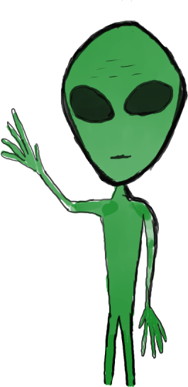
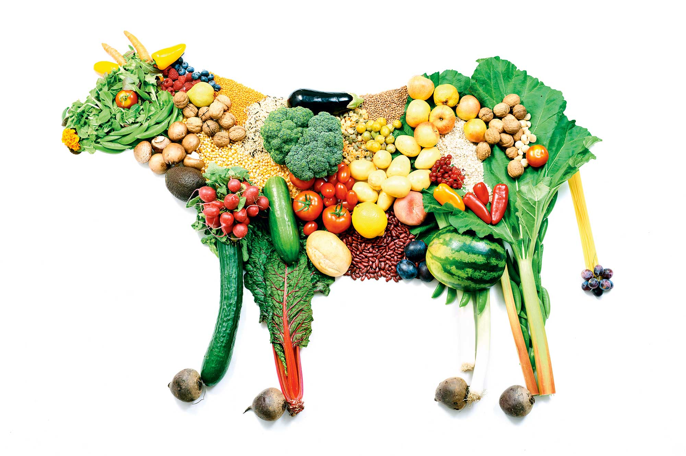
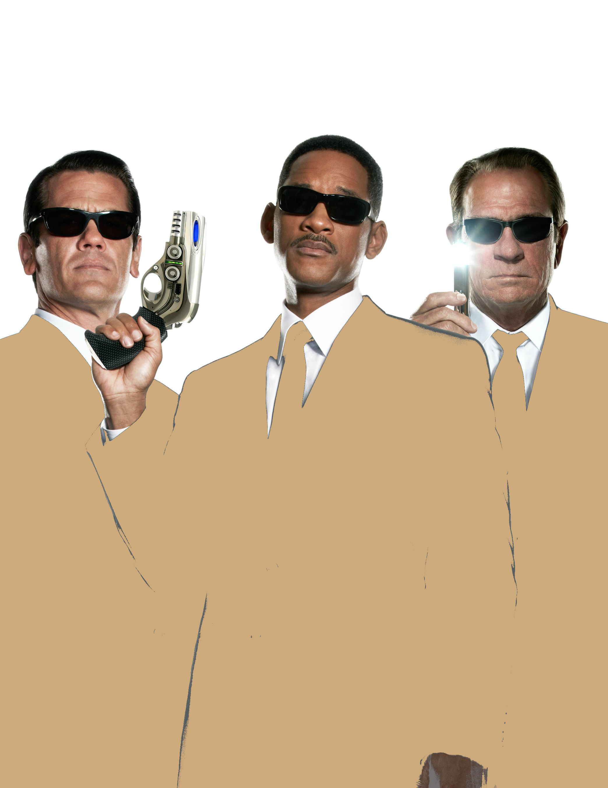

#+title: Weihnachtsgeschichte 2019
#+options: toc:nil date:nil author:nil
#+LATEX_HEADER: \usepackage{polyglossia} 
#+LATEX_HEADER: \usepackage[top=2.5cm,bottom=2.5cm,right=2cm,left=2cm]{geometry} 
#+LATEX_HEADER: \setmainlanguage{german}
#+latex_header: \usepackage[utf8]{inputenc}
#+latex_header: \usepackage{gfsartemisia}
#+latex_header: \usepackage[T1]{fontenc}
\noindent *Liebe Lesende*, es ist wieder soweit, das ist meine diesjährige
Weihnachtsgeschichte. Ich hoffe ich kann eine kleines Lächeln, ein
bisschen Schmunzeln oder ähnliches hervorrufen und für ein paar
Minuten mit einem knallharten Tatsachenbericht aus meinem Leben von
der Bitterness abzulenken die man spürt wenn man auf eine Nelke
gebissen hat[fn:2].

\noindent Wie ein Schmerzmittel also, das nicht wirklich hilft, aber die
Symptome übertuncht. Falls das deine erste Weihnachtsgesichte ist, die
ich dir schicke, dann erkläre ich das Konzept hier nochmal. Einmal vor
Weihnachten in jedem Jahr setze ich mich für ein paar Stunden hin und
schreibe in ein paar Stunden eine Geschichte, die schenke oder besser
zwinge ich meine Opfern, so auch dir, als /Geschenk/ auf. Der Clou
ist, das ich nur _einmal_, ein Geschenk _selbst mache_ (also keine
Pfenning dafür ausgeben) und das dann auch noch an _alle_, die
überhaupt was bekommen verschenke - mehr Vögel kann man kaum mit einem
Stein erschlagen. Am Schluss gebe ich auch noch vor hart an der
Geschichte gearbeitet zu haben (Notiz an mich diese Vorwort
entfernen) - das perfekte Verbrechen.

#+BEGIN_CENTER
/Fröhliche Weihnachten und einen guten Rutsch ins neue Jahr/

/dein Simon/
#+END_CENTER
\newpage
* Extraterestische Mitbewohner
#+ATTR_LATEX: :width 0.2\textwidth

\noindent Ich sitze auf der Couch und kucke eine Cartoon serie. Es gibt ja 
Leute die finden, /Zeichentrick/ ist was für Kinder. Auf dem
Bildschirm zersägt eine fidel glucksende Maus eine lustig schreiende
Katze - Kinderzeug halt. 

\noindent Es klopft. 

\noindent Ich blicke auf, hat es wirklich geklopft? Wenn ich mich 
gaaanz still halte geht mein Nachbar vielleicht wieder weg.

\noindent  Es klopft erneut. Na Klasse. Ich stehe seufzend auf und 
schlurfe zur Tür. Wenn ich gaaaanz langsam gehe, geht mein
Nachbar vielleicht wieder weg bevor ich die Tür erreiche. 
Vielleicht hab ich das Klopfen einfach nicht gehört.

\noindent Es klopft - poch, poch, poch. Oh man, ich will nicht! Ich
will jetzt nicht reden, denken, ich will sehen wie eine
Maus einer Katze das Gesicht mit einer Kettensäge absäbelt. Aber was 
ich ganz bestimmt nicht sehen will ist das besserwisserische Gesicht
von Herrn Perfekt - "Haben sie eine Ahnung wer die Dosen in den
Restmüll getan haben, die gehören nämlich in die gelbe Tonne", wird er 
wieder wie Oberlehrer salbungsvoll die Hausverwaltungsregel 3a zitieren.
Und ich werde murmeln: "...und am ende wird alles auf dem gleichen
Haufen gekippt und verbrannt..." 

\noindent Poch, poch, poch! Ja, ja ist ja schon gut. Ich bin an der
Tür angekommen und mein Nachbar steht offentsichtlich noch davor.
Genervt reiße ich die Tür auf. Eine kleine grüne Hand pocht in die
Luft, an der zuvor noch die Tür gewesen ist. Ich blicke von der Hand,
einen dünnen, grünen Arm entlang zu einem riesigen, grünen Kopf. 

#+BEGIN_CENTER
/Samstag Morgen, es klingelt und ein Alien steht vor mir./
#+END_CENTER

\noindent Das Alien lächelt, drückt mir einen Brief in die Hand und geht an mir
vorbei in die Wohnung. Ich stehe in der immer noch offenen Tür,
und lausche. Vielleicht kann ich die Leute von der versteckten Kamera ja
hören - es ist totenstill. Plötzlich reißt mich eine jubelnde Menge
aus meiner Leichenstarre. Ich schließe die Wohnungstür. 

\noindent Das Alien sitzt mit baumelnden Beinen auf der Couch und hält
die Fernbedienung, die in seinen kleinen Händen riesig aussieht. Jetzt
stehe ich nicht weniger doof als zuvor in der Wohnzimmer tür und
blicke meine /Gast/ unsicher an. Ich kratze mich an der
Strin. Schließlich setze ich mich dazu. Mir fällt das Kuvert in meinen
Händen auf. Etwas unsicher und mit zittrigen Fingern frimmele ich am
Papier rum. Ich krieg das dumme Ding einfach nicht auf. Als ich schon
auf geben will nimmt mir das Alien den Brief aus der Hand. Aus seinen
Augen schießen Laserstrahlen die den oberen Rand des Kuverst sauber ab
schneiden. Wow. Jetzt riecht es nach verbranntem Papier. Ich nehme mir
das Kuvert wieder greife hinein. Ein einzelnes Blatt Papier. Es steht
nichts darauf - solange man es nicht umdreht. Bevor ich den Text zu
lesen beginne, werfe ich noch einen Blick auf meinen ominösen Gast, 
der sich /Kochen mit Lanz/ in der Glotze mit erschreckender
Begeisterung ansieht. Okay, *here we go...*

\noindent Ich lese die paar Zeilen schnell, hastig und verhaspele mich
mehrmals. Aber auch als ich zum vierten, fünften Mal durch die Zeilen
bin begreife ich immer noch nicht so ganz was das soll. In ein paar
kurzen Sätzen erklärt eine Mutter, das ihr Kind, das neben mir
sitzende nämlich, sich um eine Praktikumsstelle bewirbt. Das ganze
soll über den Zeitraum der kommenden Woche vor Weihnachten gehen. 
Selbstverständlich nehme mein extraterestrischer Praktikant gerne das
Angebot an bei mir zu wohnen - natürlich auf - meine Kosten. 
Ganz am Ende des Text ist noch einer dieser Barcodes,
die man mit seinem Smartphone scannen kann. 
Mein Handy macht ein erfreutes /Ding/ als der Scanvorgang
erfolgreich abgeschlossen wurde und öffnet eine Website. Es ist eine
Jobsuchwebsite auf der man kostenfrei Jobangebote veröffentlichen
kann, also eine von der Sorte, die über und über mit Werbung für alle
möglichen und unmöglichen Produkte voll gekleistert ist. Und da ist
auch das Ziel des Barcodelinks. Vor ein paar Jahren kamen ein Kumpel
und ich bei einem alkoholisch motivierten Abend auf die Idee, das es
cool wäre einen Praktikant zu haben. Einen Angestellten, den man nicht
bezahlen muss, der aber alle bescheuerten Aufgaben für einen
übernehmen muss[fn:1]. Noch in der selben Nacht veröffentlichten wir
eine Annonce, die nach einem fleißigen, teamfähigen, creativen,
belastbaren und teamfähigen Praktikant ausschau hielt. Unser Firma, 
die /Todeslaser Manufaktur Gmbh&Co/, deren Geschäftsfeld daran bestand
mithilfe von radioaktiven Joghurt eine Zombieapokalypse zu verursachen
um dann unsere /Waren/ zu verkaufen und dadurch unfassbar reich zu
werden. Es ist nicht näher beschrieben, was diese Waren sind, aber der
Firmename beinhaltet das Wort Todeslaser. Tatsächlich ist der Rest der 
Stellenbeschreibung weniger bescheuert und beinhaltet die beschriebene 
Unterkunft. 

\noindent Inzwischen kommt im Fernsehen /Bares für Rares/, jedes mal
wenn das Alien zwinkert wechselt der Kanal. Seufzend erhebe ich mich,
gehe zum Fernseher und schalte das Gerät aus. Dann stelle ich mich
unsicher vor meinem Praktikanten auf und frage:
#+BEGIN_CENTER
"Wie heißt du eigentlich?"
#+END_CENTER
Seine Augen fokusieren mich, und ich bin mir nicht sicher, ob meine
Kehle gleich von Laserstrahlen wie der Brief zerschnitten wird. Die 
Augenlider schließen sich in Zeitlupe, und als Augenlid auf
Augenlid trifft springt der Fernseher hinter mir wieder an. Ich zucke
erschrocken zusammen und drücke den Ausknopf. Er zwinkert, ich drücke, 
An - aus - An - aus ... 
#+BEGIN_CENTER
"Es reicht!!", brülle ich. Hinter mir springt der Fernseher erneut an.
#+END_CENTER
Ich nehme das Alien an der Hand, und gehe in die Küche. "Sitz", knurre
ich und fange an Tee zu kochen. Anstatt sich hinzusetzen beobachtet
das Alien jeden meiner Handgriffe. Mein Praktikant ist kaum groß genug um
auf die Arbeitsplatte zu sehen, also benutzt er die Griffe der
Topfschubladen als Leitersprossen. Wir setzen uns an den Küchentisch,
und ich zeige ihm wie man den Teebeutel auspresst, umrührt und pustet.
Langsam beruhige ich mich wieder.
#+BEGIN_CENTER
"Okay, sehr gesprächig bist du ja nicht. Kannst du überhaupt sprechen?"
#+END_CENTER
Es kommt keine Antwort, aber er legt den Kopf schräg. In dem Moment
erinnere ich mich auch an den Brief die Autorin sprach von ihrem
/Sohn/, also ein /der/ - das macht das Schreiben der Geschichte um
einiges einfacher. 
#+BEGIN_CENTER
"Verstehst du was ich sage?", frage ich als nächstes.
#+END_CENTER
Zum ersten Mal bekomme ich eine unmissverständliche Antwort. Er kuckt
mich mit einem /Ist das dein Ernst?/-Blick an. Die Gestik und Mimik
des Aliengesichts ist erstaunlich vielschichtig.
Ich überlege kurz, dann hole ich einen Stift und Papier.
#+BEGIN_CENTER
"Deine Mutter, hat geschrieben das du hier bei mir eine Praktikum
machen willst, aber das geht nicht. Ich habe leider kein ... zu viel
zu tun ... kannst du mir bitte die Nummer von deiner Mutter geben?"
#+END_CENTER
Ich schiebe ihm Zettel und Stift rüber. Er steht auf und verlässt den
Raum. Schnell hinterher. Im Wohnzimmer angekommen steht der Alienjunge
wieder vorm Fernseher. Ich schnaufe tief aus, aber als er zwinkert
erscheint kein abgehalfterter deutscher Schlagersänger auf dem
Bildschirm, sondern eine grüne Gestallt, die meinem Praktikanten sehr
ähnlich sieht. Sie zwinkert mit den Augen, er deutet auf mich, sie
stempt unmissverständlich die Arme in die kaum vorhanden Alienhüften.
Resignierend halte ich meine Adventskalender in die Höhe und frage:
#+BEGIN_CENTER
"Bis wann?"
#+END_CENTER
Alienmutter fixiert Aliensohn, der wiederum auf das größte Türchen
deutet - na Weltklasse. Ich blicke die Mutter flehend an
#+BEGIN_CENTER
"Können sie bitte wenigtens sagen wie sein Name ist?"
#+END_CENTER
Die Alienmutter verschwindet einen Moment aus dem Bild, und hält dann
eine Zettel hoch, der mit Symbolen beschrieben ist, die ich nicht
lesen kann. Ich nicke ergeben und schalte den Fernseher wieder aus. 
Mein Praktikant kommt jetzt auf mich zu und berührt mit seinen langen
dünnen Fingern meine Stirn, und auf einmal kann ich eine Stimme in
meinem Kopf hören:
#+BEGIN_CENTER
"Mein Name ist Zuschwerfüreinenmenschenauszusprechenunderstaunlichschwerzutippenundzulesenundziemlichlangabercoolneinwirklichwennichesdirsage"
#+END_CENTER
#+BEGIN_CENTER
"Okay, ich nenn dich /Zuschwer/", entscheide ich.
#+END_CENTER
#+BEGIN_CENTER
"Ja, ja das ist eine gute Lösung", erwiedert die Stimme. 
#+END_CENTER
#+BEGIN_CENTER
"Gut, nachdem du so begeistert von meinem Fernseher bist, lass uns das
mal richtig angehen, und das beinhaltet bestimmt kein deutsches Vormittagsfernsehen"
#+END_CENTER
Ich setze mich auf die Couch, Zuschwer daneben und den Rest des Tages
verbringen wir mit Filmen und Serien, die absoluten Filmklassiker, das
beste was mir grade so einfällt und drei Streamingdienst subscriptions
auf Lager haben.

\noindent Als ich um 3 uhr nachts aufschrecke, lehnt Zuschwer mit  seinem massiven
Kopf und dem Daumen im Mund an mir und schläft. Ich stehe vorsichtig
auf, lege eine Decke über ihn und schalte den Fernseher aus. Ich bin
ja gespannt was mich in den nächsten Wochen erwartet.
\newpage
* Veganismus
#+ATTR_LATEX: :width 0.6\textwidth

Wir sitzen in einem FastFoodRestaurant. Eine Freundin von mir hat sich
gemeldet und gefragt ob ich zeit auf einen Kaffee habe. Sie ist auf
dem Weg von einer Demonstration gegen Umweltverschmutzung im Rahmen
eines Umweltgipfels in einer Stadt zu einer Demonstration gegen die
Ausbeutung von Tieren im Rahmen eines Artenschutzgipfels in einer
anderen Stadt und ihr Zug hat Aufenthalt in iner dritten Stadt - die
Stadt in der ich lebe. Deshalb treffen wir uns im Erdgeschoss eines
Bahnhofs in einem FastFoodRestaurant. Der Vorgang war einigermaßen
kompliziert, weil Anna Veganerin ist, weswegen sie versucht
Unternehmen zu meiden, die Tierische Produkte verkaufen/vermarkten
oder sonst irgendwie an dem Massengenozid unserer tierischen Brüder
beteiligt sind. Auf der anderen Seite ist da Zuschwer, der umbeding
Chickennuggets wollte. Anna empfang mich freude strahlend, der riesige
Backpack auf dem Rücken machte es schwer sie zur Begrüßung zu
umarmen. Dann beugte sie sich zu Zuschwer hinunter und schüttelte
seine Hand. 

\noindent Das Restaurant hat so eine moderen Bestellmetode, bei der
man auf einer Säule mit Touchscreen sein Essen bestellt, bezahlt und
dann in einer ewig lange Schlange darauf warten darf. Als ich mit zwei
Kaffee und einer Packung Chickennuggets zu Anna und Zuschwer zurück
komme hält Anna grade einen Vortrag über die Verunreingung des
Grundwasser verursacht durch die industrielle Landwirtschaft. Zuschwer
blickt sie wortlos an und legt den Kopf schräg. Ich habe den Gedanken,
falls Zuschwer ein Alienspion ist, der geschickt wurde um die
Schwachstellen der Menschen auszuspionieren, dann kommt er nach diesem
Gespräch bestimmt zum Schluss, dass es reicht einfach ein bisschen zu
warten. Ich gebe Anna einen der Kaffees und Zuschwer die Nuggets.

\noindent Anna ist zwar nicht scheu ihre Meinung zu sagen, aber sie
ist auch nicht Hardcore. Die nächsten Minuten unterhalten Anna und ich
uns über allerlei Zeug was die letzen Monate passiert ist, was im
kommenden Jahr ansteht usw. Währendessen verspeißt Zuschwer mit
gesundem Appetit seine Nuggets. Als er aber fertig ist, tippt er mich
zunächst sanft dann aber immer beharrlicher an. Ich rolle mit den
Augen, und wills schon Richtung Bestellsäule gehen als Anna mich
aufhält.
#+BEGIN_CENTER
"Lass gut sein, ich geh diese mal. Zuschwer, komm wir finden bestimmt
auch was ganz leckeres veganes."
#+END_CENTER
Als Anna und Zuschwer gefühlt eine Stunde später wieder zurück kommen
haben sie alles was die vegan/vegetarische Karte des
FastFoodRestaurants zu bieten hat dabei - es sind erstaunlich viele
Schächtelchen. Ich bestehe darauf zumindest einen Teil der Rechnung zu
übernehmen - Anna ist ja auch keine reiche Erbin und Zuschwer wohnt ja
bei mir, ist mein Praktikant. 

\noindent Eine Durchsage währe jetzt zuhören in der Geschichte, wenn
das ein Film wäre - da es die Realität ist, bemerkt Anna
selbstständig, das sie zu ihrem Zug muss. Sie Umarmt uns beide noch
schnell und verschwindet dann Richtung Gleise.
#+BEGIN_CENTER
"Ich muss los, macht es gut", ruft sie zum Abschied.
#+END_CENTER
Wir bleiben mit einem Berg an vegatarischen Zeugs zurück.

\noindent Ich habe keinen Hunger, aber Zuschwer öffnet Box für Box und
nimmt einen Bissen heraus, beäugt das Essen und legt es wieder in die
Box zurück. Ich stupse ihn an.
#+BEGIN_CENTER
"Komm schon, du probierst einen Bissen, ich probiere einen Bissen?",
schlage ich vor.
#+END_CENTER
Er wendet mir seinen Kopf zu, streckt dann eine Finger aus und berührt
meine Stirn mit seinen fettigen Griffeln.
#+BEGIN_CENTER
"Ich habe jedes Stück überprüft, in sämtlichen Gerichten sind
tierische Proteine enthalten - ich kann diese Gerichte nicht essen",
erklärt seine Stimme in meinem Kopf
#+END_CENTER
#+BEGIN_CENTER
"Hä, bist du jetzt auf einmal Veganer?", frage ich überrascht.
#+END_CENTER
#+BEGIN_CENTER
"Meine Spezies ernährt sich ausschließlich vegan", antwortet Zuschwer
#+END_CENTER
#+BEGIN_CENTER
"Momentmal, du hast doch vorher eine ganze Packung Nuggets
gefuttert?", frage ich verdutzt.
#+END_CENTER
#+BEGIN_CENTER
"Alles ist Hühnchen, außer Chickennuggets, die sind aus Tofu"
#+END_CENTER
#+BEGIN_CENTER
"Ich hab das Gefühl den Spruch hast du geklaut", erwiedere ich.
"Ist das wirklich so strickt? Ein kleiner Bissen bringt dich schon
nicht um"
#+END_CENTER
#+BEGIN_CENTER
"Eine vegane Ernährung ist ein logischer Schluss. Mitglieder meiner
Spezies sind Tiere, Mitglieder deiner Spezies sind Tiere, Tiere sind
Tiere. Wenn ich dem Verzehr von Tieren zustimmen würde, wieso sollte
ich dann nicht dem Verzehr von Tieren deiner oder Meiner Spezies
zustimmen?", erläutert Zuschwer.
#+END_CENTER
Ich bin baff und denke das erste was mir einfällt.
#+BEGIN_CENTER
"Aber Menschen sind doch viel intelligenter als Tiere?"
#+END_CENTER
#+BEGIN_CENTER
"Und ich bin viel intelligenter als du. Ist das also okay für dich das
ich dich esse ... ich frage mich wie du wohl mit einer süßsauer Soße
schmecken würdest ..."
#+END_CENTER
#+BEGIN_CENTER
"Magst du eine 6er, 9er oder 20er Packung Nuggets, süßsauer Soße?"
#+END_CENTER
Umweltbewusst nehmen wir später die vegatarischen Sachen mit nach
Hause, wo sie so lange im Kühlschrank stehen bis sie schlecht sind.
\newpage
* Umweltschutz
#+ATTR_LATEX: :width 0.5\textwidth
 
Es ist arschkalt als wir das Haus in Richtung Tram-Bahn verlassen. An
der Haltestelle informiert uns die eine Anzeige das in 10,20,30,40,50
Minuten wieder eine Tram kommt.
#+BEGIN_CENTER
"Super, wir haben sie gerade verpasst"
#+END_CENTER
Zuschwer zieht seinen Fäustling aus und steckt seine langen, kalten,
klebrigen Finger in meine Jackentasche zu meiner Hand. Seine Finger
sind klebrig, weil er den Adventskalender geplündert hat. Über die
Berührung unsrer Finger höre ich seine Stimme in meinem Kopf:
#+BEGIN_CENTER
"Können wir mit dem Auto fahren?", bettelt er.
#+END_CENTER
#+BEGIN_CENTER
"Nein, die Tram kommt in 8 minuten", erwiedere ich.
#+END_CENTER
#+BEGIN_CENTER
"Aber mir ist kalt!", jammert seine Stimme.
#+END_CENTER
#+BEGIN_CENTER
"Im Auto ist es auch kalt, und bis die Heizung warm geworden ist sind
wir schon da", erwiedere ich fröstelnd.
#+END_CENTER
#+BEGIN_CENTER
"Du bist bloß zu faul die Scheibe frei zu kratzen", mäckert er.
#+END_CENTER
#+BEGIN_CENTER
"Erstens stimmt das nicht, ...", erwieder ich.
#+END_CENTER
#+BEGIN_CENTER
"...und zweitens na und?", vollendet er meinen Satz.
#+END_CENTER
#+BEGIN_CENTER
"Hörauf Sprüche zu klauen, sonst werden wir noch auf Copyright
verklagt. Nein, zweitens ist es viel besser für die Umwelt mit der
Tram zu fahren."
#+END_CENTER
Die Anzeige springt von einer Minute auf Leerzeichen und dann
verschwindet der Eintrag komplett und der zweite Eintrag rückt nach
oben nach - Noch 10 Minuten. Natürlich kommt keine Tram und zur
Kälte gesellt sich ein erfrischender Wind.
#+BEGIN_CENTER
"Der Umwelt ist ja auch nicht kalt, sie IST kalt! Beeil dich mal mit
deiner Erwärmung!", flucht Zuschwer in meinem Kopf.
#+END_CENTER
#+BEGIN_CENTER
"Ich hasse es wenn die das machen!", beschwere ich mich nun auch.
#+END_CENTER
#+BEGIN_CENTER
"Wenn wer was macht?", erkundigt sich das Alien.
#+END_CENTER
#+BEGIN_CENTER
"Die Öffentlichen, einen Zug/Bus/Tram ausfallen lassen und dem Leuten
nicht sagen /Achtung, achtung, wir haben Schwierigkeiten den Fahrplan
einzuhalten, gehen sie einen Glühwein trinken, oder besser zwei!/",
empöre ich mich.
#+END_CENTER
#+BEGIN_CENTER
"Also fahren wir jetzt mit dem Auto?", bettelt Zuschwer.
#+END_CENTER
#+BEGIN_CENTER
"Nein, nur noch 5 min dann kommt die Tram", denke ich zurück.
#+END_CENTER
#+BEGIN_CENTER
"Ich glaube ja nicht das das soviel besser für die Umwelt ist. Da
behaupten sie alle immer fahrt mit den Öffentlichen, das ist so gut
für die Umwelt, aber woher kommt denn der Strom für die Trambahnen?"
#+END_CENTER
#+BEGIN_CENTER
"Seit 2 Jahren hauptsächlich aus Erneuerbaren Quellen", klappere ich
im Geiste mit den Zähnen.
#+END_CENTER
#+BEGIN_CENTER
"Ja okay, vielleicht, aber was ist mit den Diesellokomotiven? Ja okay
im Durchschnitt bestimmt besser als all die Porsche Cayenne V6 Diesel
mit einer Person drin, aber was ist mit den Bussen?", hinterfrägt Zuschwer.
#+END_CENTER
#+BEGIN_CENTER
"Stadtgas, und das hätte ich jetzt auch gerne hier zum heizen, meine
Fresse ist das kalt!", keuche ich.
#+END_CENTER
Die Anzeige springt erneut von einer Minute auf Leerzeichen und dann
verschwindet der Eintrag komplett und der zweite Eintrag rückt nach
oben nach - Noch 10 Minuten. Natürlich kommt wieder keine Tram und zu
Kälte und Wind kommt ein die Sinne belebender Eisregen - herrlich.
Wir schweigen, das ist zuviel. Nach weiteren 10 Minuten wiederholt
sich das Spiel, wobei sich ein Typ zu uns gesellt, der so laut Musik
hört, das wir an seinem exquisiten Geschmack teilhaben dürfen.
#+BEGIN_CENTER
"Es ist echt beeindruckend was deine Spezies hier auf die Beine
stellt", brüllt Zuschwer über den Lärm hinweg.
#+END_CENTER
#+BEGIN_CENTER 
"Was meinst du?", rufe ich zurück.
#+END_CENTER
#+BEGIN_CENTER
"Ihr zerstört euren Planeten - versucht gleichzeitig die globale
Erwärmung aufzuhalten, rottet euch gegenseitig aus - spendet aber für
Menschen in Not, habt gleichzeitig Musik und Film die im Universum
ihres gleichen suchen - sowie WAS-AUCH-IMMER-DAS-SEIN-SOLL und habt 
noch nichtmal das intergalaktische Reise entdeckt. Aber ein
herkömmlicher Personenbeförderungskonzern, hat Tram bahnen die exakt
10 Minuten in die Vergangeheit reisen können um zu verhindern das wir
aus der KÄLTE kommen!"
#+END_CENTER
#+BEGIN_CENTER
"Wahrscheinlich eher ein Wurmloch, und die überspringen diese
Haltestelle. Komm wir fahren mit dem Auto, die Umwelt ist eh nicht
mehr zu retten"
#+END_CENTER
Der Typ mit Musik brüllt uns nach "Das sag ich der Greta!!!"
\newpage
* Der Geist des Mathebau
#+ATTR_LATEX: :width 0.4\textwidth

Maria steht mit einem bestimmt nicht akloholischen Getränk vor einer
kleinen Schar von Personen, die bestimmt ebenfalls keine alkoholischen
Getränke in ihren Händen halten. Maria machte diese Führungen durch
das Allerheiligste der Mathmatiker nun schon seit einiger Zeit mit
einer gewissen Regelmäßigkeit. Bisher war nie etwas Schlimmes
passiert, doch was wird diese schicksalsbehaftete Nacht mit sich
bringen?

\noindent Die Gruppe steigt in den Keller, folgt Maria ein paar enge,
düstere Gänge vorbei an teils verschlossenen Türen zum ersten Stop.
#+BEGIN_CENTER
"Der Mathebau wurde 1891 von Karl-Friedrich Matte und Peter-Paul Bau
gegründet und zwar auf einer heiligen Begräbnisstädte der
einheimischen Indianer", beginne ich wie mit Maria abgemacht. 
#+END_CENTER
Eine unserer Teilnehmer schaut mich unsicher an.
#+BEGIN_CENTER
"Aber wir sind in Deutschland, hier gibt es doch keine Indianer?"
#+END_CENTER
#+BEGIN_CENTER
"Keltische Indianer", kommt Maria mir zur Hilfe.
#+END_CENTER
#+BEGIN_CENTER
"Unser erster Halt ist das Pendel es Schicksals, wenn das Pendel nicht
mehr Pendelt, dann hört die Erde auf sich zu drehen ...", fahre ich fort.
#+END_CENTER
Maria öffnet die Tür zum Focauschen Pendel und deutet an, es
anzuhalten - unsrer Teilnehmer zucken zusammen.
#+BEGIN_CENTER
"Als nächstes betreten wir den Eingang zum Lüftungsraum oder wie
manche munkeln, dem Eingang zur ... Unterwelt!!!"
#+END_CENTER
Dramatisch reißt Maria die Tür zum Lüftungsraum auf - von unsren 5
Teilnehmern sind 3 betrunken vor Belustigung, eine genervt ob dem
albernen Unsinn und eine änstlich in den Bann geschlagen. Durch den
Lüftungsraum gelangen wir in einen weiteren Gang. Betreten einen Raum
in dem verschiedene Gruppen Utensillien wie Grills, Waffeleisen,
Musikanlagen lagern und halten vor einer verschlossenen Tür.
#+BEGIN_CENTER
"Unwissende nehmt reiß aus!", rufe ich dramatisch.
#+END_CENTER
#+BEGIN_CENTER
"Es heißt hinter dieser Tür befindet sich die geheime Kammer von
Peter-Paul Bau. Nach einigen Jahrzehnten voller Harmonie und okulten
Experimenten gab es plötzlichen Streit zwischen ihm und seinem
ehemaligen Partner Godrig Griffendor äh ich meine der andere, der
Mathe mit Nachnahmen hieß."
#+END_CENTER
Die Teilnehmerin, die uns die Storie halbwegs abkauft frägt
interessiert
#+BEGIN_CENTER
"Aber wieso haben sie sich zerstritten?"
#+END_CENTER
#+BEGIN_CENTER
"Bau wollte auch nicht Mathematiker, Physiker, Geologen und sogar ein
paar Informatiker in das Gebäude lassen. Und ... der andere halt war
ein Matharier, oder so ähnlich", erwiedert Maria achselzuckend.
"Auf jeden Fall hat er hier angeblich eine
Kammer des Schreckens errichtet und nur sein wahrer Erbe kann das
Monster im Inneren Befreien um den Mathebau, soll ich mal probieren ob
mein Schlüssel passt"
#+END_CENTER
#+BEGIN_CENTER
"Nein!", rufe ich gespielt entsetzt.
#+END_CENTER
Wir verlassen den Lagerraum um an unsrem letzen Halt anzukommen. An
der Tür hängen ausgeschnittene Zeitungsartikel. Bedächtig senke ich
meine Stimme.
#+BEGIN_CENTER
"Nun sind wir an dem Punkt unsrer Führung angekommen, wo es sein kann,
das schreckliche, schreckliche Dinge uns heim suchen. Bevor wir weiter
fortfahren, möchte ich euch auf diese Treppe hinweisen, die führt
direkt zurück in das Erdgeschoss"
#+END_CENTER
Eine Teilnehmerin geht genervt erleichtert direkt.
#+BEGIN_CENTER
"...da waren's nur noch 4 ....", mache ich eine Geisterstimme nach.
"Okay, der Grund wieso es nun etwas gruselig werden könnte, ist, das
hinter dieser Tür, ein grausamer Mord gescha, Maria, willst du uns
mehr erzählen?"
#+END_CENTER
#+BEGIN_CENTER
"Sehr gerne. Also, es begab sich das ein Professor in seiner Suche
nach Antworten immer frustrierter wurde, weil er zwar immer mehr
verstand und herausfand, aber je mehr er heraus fand umso mehr wusste
er auch das er soviel noch nicht wusste und vielleicht nie wissen
würde, also wand er sich an den Gehörnten..."
#+END_CENTER
#+BEGIN_CENTER
"Wenn?", wollte eine beschwiste Stimme wissen.
#+END_CENTER
#+BEGIN_CENTER
"Der Teufel. Aber der wollte ihm nur ein gratis I-Phone für seine
Seele andrehen und konnte ihm im Endeffekt auch nicht weiterhelfen,
also fing der besagte Professor an hier unten schreckliche Experimente
zu betreiben, bei denen selbst der Teufel nicht mitmachen wollte, oder
vielleicht hatte der auch bloß keine Zeit oder so. Egal auf jedenfall
viel dem Professor irgendwann was auf"
#+END_CENTER
#+BEGIN_CENTER
"Was?", eine verängtigte Stimme
#+END_CENTER
#+BEGIN_CENTER
"Das, er für sein ultimatives Experiment das Blut einer Jungfrau
brauchte", erklärte Maria.
#+END_CENTER
#+BEGIN_CENTER
"Also legte er eine Spur aus Übungsblatt-Lösungen vom Erdgeschoss
bis direkt hier her und irgendein Stundent war auch doof genug den
Köder zu fressen und der böse Professor konnte ihn sich schnappen",
setze ich die Storie fort und blicke auf meine Uhr.
#+END_CENTER
#+BEGIN_CENTER
"Das Problem war nur, das der Student keine Jungfrau mehr war, was den
Professor zwar überraschte, aber da wars schon zu spät und der Student
war schon tot."
#+END_CENTER
Ich halte mir eine Taschenlampe von unten ans Gesicht.
#+BEGIN_CENTER
"Und seit dem spukt der Student durch den Keller des Mahtebau"
#+END_CENTER
Pünktlich wie die Mauer taucht ein scheinbar schwebendes weißes Lacken
am Ende des Ganges auf und Gespenster Geräusche ertönen.
Die Teilnehmer unser Expedition geben Fersengeld und Maria und ich
Lachen uns den Ast ab. 
#+BEGIN_CENTER
"Das hast du super gemacht Zuschwer", sage ich.
#+END_CENTER
Zuschwer zupft an meinem Arm, deutet auf den Geist.
#+BEGIN_CENTER
"Ja ganz toll, hast du diese Puppe da hingestellt"
#+END_CENTER
Ich blicke Zuschwer, der sich als Geist verkleiden sollte an, dann
Maria, dann das näherkommende Gespenst.
#+BEGIN_CENTER
"Maria, ehm ... LAUF!!!!!"
#+END_CENTER
\newpage
* The Men in Beige
#+ATTR_LATEX: :width 0.3\textwidth 

Zuschwer und ich sind auf dem Weg heim mit vielen
Weihnachtseinkäufen. Zuschwer hat sich in der Faschingsabteilung so
eine total doofe Brille mit riesiger Nase und Falschem Schnauzbart
gekauft. Er sieht total schräg damit aus, aber immer noch eindeutig
wie ein Alien. Als wir die Wohnung betreten geht Zuschwer richtung
Küche um Tee zu kochen, während ich ins Wohnzimmer gehe. Als ich den
Raum betrete drehen sich zwei Drehstühle, die da sonst nicht stehen,
um und ich blicke in die Sonnenbrillen bewerten Gesichter von zwei
Agenten. Der Eine macht ein Foto von mir mit seinem Smartphone - der
helle Blitz lässt mich meine Gastfreundschaft vergessen.
#+BEGIN_CENTER
"Was zum Teufel machen sie hier?", brülle ich.
#+END_CENTER
#+BEGIN_CENTER
"Mit dem Herrn der Hölle haben wir nichts zu tun, Herr Student"
#+END_CENTER
Es klopft an die Wohnungtür und eine dumpfe Stimme von draußen frägt:
"Will jemand ein gratis I-Phone?"
#+BEGIN_CENTER
"Wir sind sie?", will ich wissen. 
#+END_CENTER
Ich greife zum Telefon, ich will die Polizei rufen.
Die Beiden ziehen Dienstausweiße und ein amtlich wirkendes Schreiben.
#+BEGIN_CENTER
"Hausdurchsuchung?", schlucke ich erschrocken.
"Aber, was, wieso?", stammele ich.
#+END_CENTER
#+BEGIN_CENTER
"Herr Student, es besteht kein Grund zur Panik. Wir sind sie da, wir
sind die da - Wir sind die Man in beige"
#+END_CENTER
Das Licht geht an die Beiden tragen tatsächlich beige Anzüge.
#+BEGIN_CENTER
"Wie die Men in Black, nur in beige? So mit Alien-Killer-Kakerlaken?",
frage besorgt.
#+END_CENTER
#+BEGIN_CENTER
"Ja, black ist nicht mehr politisch korrekt. Aber ja genau Aliens und
so. Wir vermuten das ein - er nickt Zuschwer zur Begrüßung zu - Alien
in ihrer Wohnung versteckt", erklärt der andere MIB.
#+END_CENTER
Ich starre Zuschwer, der sich über den vom Tee feuchten falschen Bart,
streicht an.
#+BEGIN_CENTER
"Wer ist ihr nicht außerirdischer Freund, können wir auch Tee haben?",
frägt mich der erste MIB wiederum.
#+END_CENTER
Ich blicke im Dreieck zu den drei Leuten hier. Zu den /Agenten/, die
Aliens fangen sollen, zu dem Alien, das einen falschen Bart trägt,
den er wiederum anhebt um seinen Tee besser trinken zu können, zurück
zu den Agenten, die das Alien als solches nicht erkennen. 
#+BEGIN_CENTER
"Woran erkennt man denn ein Alien, grüne Haut?", frage ich.
#+END_CENTER
Zuschwer wirft mir einen /Lass-Dass/-Blick zu. 
#+BEGIN_CENTER
"Zum Beispiel ja, wenn jemand grüne Haut hat, wäre das ein klares
Zeichen dafür, dass es sich um ein Alien handelt", stimmt mir einer
der Agents zu.
#+END_CENTER
#+BEGIN_CENTER
"Aber wenn sie sich nicht mehr sicher sind, wie ein echter Mensch
aussieht, dann sehen sie sich uns an, oder ihr eigenes Spiegelbild
oder ihren Freund hier - alles ganz eindeutig keine Aliens", ergänzt
der zweite.
#+END_CENTER
Ich nicke, und gehe in die Küche. Als ich wieder komme sitzt Zuschwer
auf der Couch, während die beiden MIB's in alter /Uncle-Sam-wants-you/
Manier, versuchen Zuschwer als MIB anzuwerben. Dabei rattern sie die
Gefahren von Aliens für die menschliche Bevölkerung runter. 

\noindent Nach ein paar Stunden Alien suche in unsrer Wohnung kommen
die Agents zum Schluss, dass es wohl Falscher Alarm war und fragen ob
wir uns jetzt noch zusammen Pizzas bestellen sollen und einen Film
kucken. Ich schlage einen Scifi-Thriller mit Doppelagenten und Aliens,
die die Haut von Menschen überstreifen vor. Das Telefon geht Reih um
und jeder spricht seine Bestellung ins Telefon, außer Zuschwer, für
den bestelle ich eine große Salamipizza - is ja eh alles Tofu. Als
letztes bestellt der zweite Agent:
#+BEGIN_CENTER
"...und für mich eine Pizza Hawai..."
#+END_CENTER
In dem Moment zückt der andere Agent die Waffe. Der Agent, der ein
Alien ist, wird schlagartig grün im Gesicht und rennt auf die Tür zu. 
Der Agent beginnt Laserblitze abzufeuern und brüllt zur Erklärung:
#+BEGIN_CENTER
"Kein Mensch würde freiwillig so was ekelhaftes bestellen!!!"
#+END_CENTER
Innerhalb von Sekunden verschwinden die Beiden im Treppenhaus.
Zuschwer blickt mich wie ein Hund an. Ich nehme das Telefon auf
und ändere seine Salami in eine Hawai.
#+BEGIN_CENTER
/Bon Appetit/
#+END_CENTER
\newpage
* Das Weihnachtsgeschenk
#+ATTR_LATEX: :width 0.4\textwidth

Am Morgen des 24. werde ich von lauten Geräuschen geweckt. Ein
Raumschiff schwebt im Hinterhof. Das Raumschiff ist in etwa so laut
wie ein Hubschrauber, mindestens so cool und fast so kompliziert.
Zuschwer steht am Fenster und blickt unglücklich runter - sein
Praktikum ist jetzt vorbei und er muss wieder nach Hause und zurück in
die Schule. Das liegt daran das Aliens kein Weihnachten feiern. Sie
feiern nur Oster. Zuschwer hat mir erklärt, das aus ihrer Sicht, die
Geburt irrelevant ist, weil ohne das ganze Auferstehen und so weiter
wärs ja nix besonderes gewesen - toll ein Baby in einer
Krippe. Niedlich aber nicht umbedingt die inovativste Story.

\noindent Zuschwers Mutter nimmt erst ihren Sohn, dann mich in den
Arm. Es gibt eine rührende Abschiedsszene und schließlich sind die
Aliens weg und ich mache mich fertig zu meiner Familie zu fahren.
Ich bin grade dabei die Wohnung abzuschließen, als ich ein Paket sehe,
das neben meiner Tür liegt. Zuschwer hat mir doch tatsächlich ein
Weihnachtsgeschenk dagelassen - obwohl er gar nicht feiert. Gerührt
setze ich mich mit dem Geschenk ins Wohnzimmer und packe es aus. Es
ist ein komisches rundes, glänzendes Ding. Anbei liegt ein Brief:
#+BEGIN_CENTER
"Da deine Spezies, oder besser der öffentliche Nahverkehr deiner
Spezies im Winter vermehrt Zeitreisen und Wurmlöcher einsetzt habe ich
mir gedacht du kannst das vielleicht brauchen. Wenn du mal an einer
Haltestelle stehst und wieder eine Stunde umsonst warten musst, dann
drück den Zeitreisestein für 3 Sekunden und du bist wieder daheim im
Bett eine Stunde früher - und du weißt das du ausschlafen kannst.
Fröhliche Zeitreise und Weihnachten, dein Zuschwer"
#+END_CENTER
#+BEGIN_CENTER
/Fröhliche Weihnachten/
/Dein Simon/
#+END_CENTER
* Footnotes

[fn:2] Mama weniger Gewürze, brauchst gar nicht so schauen

[fn:1] Diese Idee wurde später sogar von einem bekannten
Schriftsteller gestohlen und in einem Buch verwendet.
