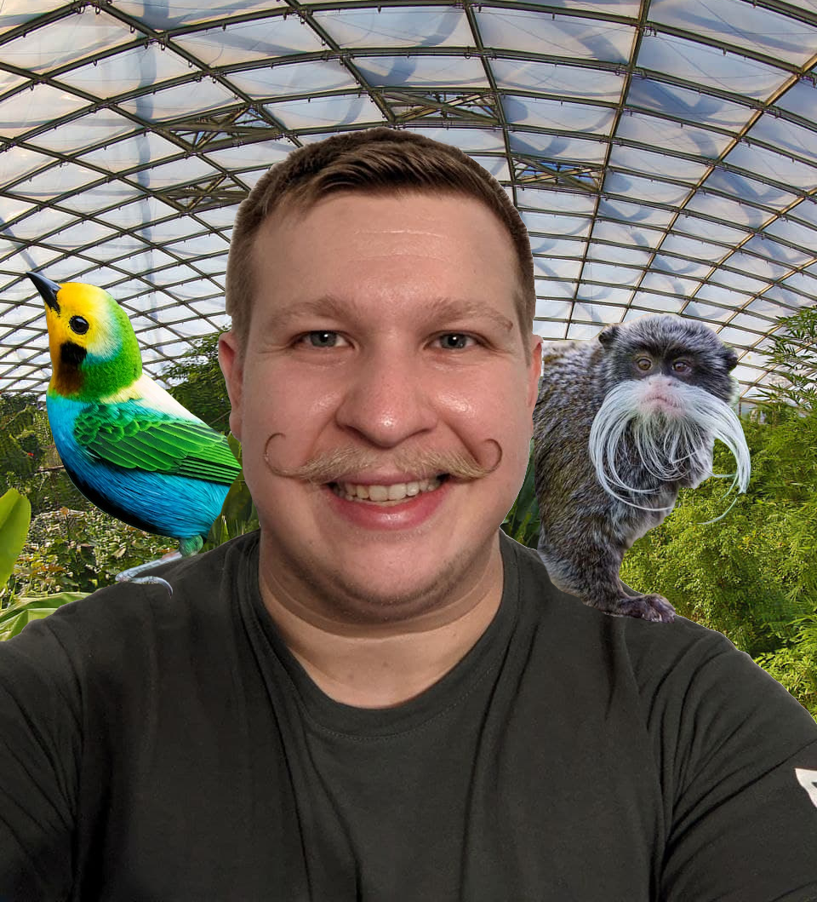

#+TITLE: Simons @@latex:\\@@ wunderbare @@latex:\\@@ Weihnachtsgeschichte(n)
#+EXCLUDE_TAGS: noexport
#+LaTeX_CLASS: weihnachtsgeschichte
#+OPTIONS: toc:nil author:nil date:nil
#+LATEX_HEADER: \usepackage[left=2.0cm,right=2.0cm,top=2.5cm,bottom=2.0cm]{geometry}
#+LATEX_HEADER: \makeatother
#+LATEX_HEADER: \usepackage{color}
#+LATEX_HEADER: \definecolor{marron}{RGB}{60,30,10}
#+LATEX_HEADER: \definecolor{darkblue}{RGB}{0,0,80}
#+LATEX_HEADER: \definecolor{lightblue}{RGB}{80,80,80}
#+LATEX_HEADER: \definecolor{darkgreen}{RGB}{0,80,0}
#+LATEX_HEADER: \definecolor{darkgray}{RGB}{0,80,0}
#+LATEX_HEADER: \definecolor{darkred}{RGB}{80,0,0}
#+LATEX_HEADER: \definecolor{shadecolor}{rgb}{0.97,0.97,0.97}
#+LATEX_HEADER: \usepackage{titlesec}
#+LATEX_HEADER: \usepackage{fancyhdr}
#+LATEX_HEADER: \input GoudyIn.fd
#+LATEX_HEADER: \newcommand*\initfamily{\usefont{U}{GoudyIn}{xl}{n}}
#+LATEX_HEADER: \usepackage{lettrine}
#+LATEX_HEADER: \newcommand{\cb}[1]{\lettrine[lines=3]{#1}}
#+LATEX_HEADER: \usepackage{fouriernc}
#+LATEX_HEADER: \usepackage{venturisold}
#+LATEX_HEADER: \newcommand{\sectionbreak}{\clearpage}
#+LaTeX_HEADER: \renewcommand\thesection{}
#+LaTeX_HEADER: \renewcommand\thesubsection{}                  
#+LATEX_HEADER: \graphicspath{{figures/}}

* Vorwort
  Alle Jahre wieder ...

  \noindent Hallo lieber Leser, liebe Leserin, liebes Lesikon. Wenn du
  dies ließt, dann wurdest du mit meiner alljährlichen
  Weihnachtsgeschichte bedacht. Die Weihnachtsgeschichte begann in
  einem Jahr in dem ich entweder zu pleite oder zu faul war Geschenke
  zu kaufen. So oder so es führte dazu, dass ich nun schon seit
  etlichen Jahren, ein selbst-gebasteltes Geschenk unter die Leute
  bringe. Dabei ist wie immer ganz wichtig, das alles, was ich hier
  von meinen Fingern per Computer zu Papier bringen selbstverständlich
  die Wahrheit und nur die Wahrheit ist. Außerdem sollte beachtet
  werden, das der Konsum von bewusstseinserweiternde Substanzen zwar
  nicht notwendig für das Lesen dieser Geschichten ist - sich aber
  vermutlich durchaus positiv darauf auswirkt. Daher schon mal an
  dieser Stelle - nimm dir ein Glas Kinderpunsch mit Schuss oder einen
  schönen Weihnachtssekt und gib für einige Minuten vor du würdest
  diese Geschichte wirklich lesen. Hahaha und wenn du bis hier her
  gekommen bist - irgendwo in der Geschichte die richtigen 6 Lotto
  Zahlen versteckt. Und wie jedes Jahr - wer Rechtschreibfehler findet
  meldet diese bitte in den Kommentarsection eines Youtubevideos der
  AfD, dann steht da auch mal was halbwegs Sinnvolles.

  #+begin_export latex
  \begin{center}
    Lieber Leser, ich wünsche dir schöne Weihnachten oder ein beliebiges Heidnisches Fest deiner Wahl, das zufällig auf den gleichen Tag fällt. Und natürlich viel Spaß beim Lesen und dann später einen guten Rutsch in neue Jahr.
  \end{center}
  #+end_export
* Frankenstein
  #+ATTR_LATEX: :width 8cm
  [[file:frankesteiner.png]] \cb{D}ie Peitsche knallte im
  transsilvanischen Mondschein. Ein Wolfs-heulen in der Ferne
  übertönte das Rattern der Kutsche. Es war arschkalt. Nein wirklich!
  Der Wind rüttelte an den eisbeschlagenen Fenstern, die bei jedem
  Stein beunruhigend knackende Geräusche machten. Mein Atem bildete
  Nebelschwaden vor meinem Gesicht. Ich schlang meine Arme enger um
  mich. Mir gegenüber saß eine alte Frau - über und über in bunte
  Stoff gehüllt, die unbeirrt Gebete murmelte, sich bekreuzigte und
  abwechselnd mit einer Weihwasser Kelle nach mir spritzte und
  abfällig vor meine Füße spukte. Genervt versuchte ich mich auf etwas
  anderes als den Aberglauben dieser netten Dame zu konzentrieren -
  z.B. das bedrohlich näher kommende Wolfsgeheul gerade als Madame in
  ihrem Mantra mal wieder dabei war gurgelnd Spucke in ihrem Schlund
  zu sammeln ertönte ein Ruf des Kutschers, gefolgt von einem
  Quietschen. Zeitversetzt kam die Spuckerin in meine Richtung
  geflogen! Ich konnte gerade noch ausweichen; Sie knallte mit
  Schmackes links neben mir auf die Sitzbank und das Gefährt war zum
  Stehen gekommen. Der Kutscher sprang dumpf in den Schnee, watschelte
  um die Kutsche und öffnete die Tür. Noch kältere Luft drang ins
  Innere. Der Kutscher hielt seinen Arm ins innere, die nun
  verdatterte Dame griff danach. Ohne lange zu fackeln zog der Mann
  den Arm samt Frau aus der Kutsche und stellte sie hin. Durch die Tür
  sah ich eine Reihe von Menschen in einer mir unbekannten Tracht. Die
  Tür schwang zu. Kurz darauf fuhr die Kutsche wieder an. Nun war ich
  zwar verschont davon gleichzeitig gesegnet und oder exorziert zu
  werden, aber dafür war mir jetzt langweilig.

  \noindent Ich beschloss den Brief nochmal zu lesen, der die Ursache
  für meine Reise war. Dieser komische Brief. Vor ein paar Wochen
  hatte ich mal wieder meinen Briefkasten ausgeleert und zwischen
  Werbung und Werbung und noch mehr Werbung befand sich ein
  ungewöhnlicher Brief. Der Versender hatte das beschriebene Blatt,
  ein grobes, gelbliches Papier, so gefaltet das ein Brief daraus
  wurde. Um den /Umschlag/ zu schließen prankte er schweres rotes
  Wachssiegel mit einem mittelalterlichen Wappen der Frontseite. Die
  Nachricht im Inneren, war jedoch noch ungewöhnlicher!

  \noindent Der Kutscher knallte seine Peitsche, es Quietschte und
  Augenblicke vor dem Aufprall erinnerte ich mich daran das ich beim
  letzten Halt auf den warmen Platz der Spuckerin gewechselt war. Der
  Schmerz in meinen Gliedern übertönte die Kälte. Die Tür sprang auf,
  ein Arm schnellte herein und packte mich. Sanfter als erwartet
  stellte der Kutscher mich ab. Er tippte sich an die Hutkrempe,
  nickte mir aufmunternd zu und watschelte Richtung Kutschbock. Wir
  waren an unserem Ziel angekommen. Ich hob meinen Blick und starrte
  fassungslos die massiven Mauern, die Zugbrücke, Türme und Mauern
  an. Es hatte aufgehört zu schneien, so als hätte das heimliche,
  flauschige Weich Angst sich auf den Dächern der bedrohlichen Burg
  nieder zu lassen. Während die Kutsche sich schlingernd entfernte
  erschien eine ominöse Gestalt auf der Zugbrücke. Ein kleiner Mann in
  schwarzer Kutte schlich auf mich zu. Ein Blitz zuckte herunter und
  traf funken sprühend einen der Türme. Der Mann hob eine knochige
  Hand zur Begrüßung. Er blieb coronakonform 1.5Meter von mir
  entfernt stehen. Wir verharrten für einige Sekunden bis ich
  schließlich meine Stimme erhob:

  #+begin_center
  "Bist du ... ?", begann ich zu fragen.
  #+end_center

  \noindent Ich kam mir extrem dumm vor, aber nach ein, zwei Sekunden
  versuchte ich es noch einmal:

  #+begin_center
  "Bist du ... ?"
  #+end_center
  
  \noindent Aber dankenswerterweise wurde ich unterbrochen.

  #+begin_center
  "Ich bin nicht der den du erwartest!", kam es gackernd von der
  Kapuze.
  #+end_center

  \noindent Dann zog er selbige zurück. Ich zuckte erschrocken
  zurück. Die Augen, die zuvor in entgegengesetzte Richtungen gestarrt
  hatten, fixierten mich. Anschließend ertönte ein Lachen, das mir das
  Blut in den Adern erstarren ließ. Außerdem führte es dazu das der
  kleine Mann sich verschluckte und stark zu husten begann. Eilig
  näherte ich mich um Marty Feldmann auf dem Rücken zu klopfen. Als er
  sich wieder erholt hatte wollte ich nun wissen:

  #+begin_center
  "Okay, lass mich raten, dein Name ist Eigor?"
  #+end_center

  Er blickte auf, das linke Auge, wanderte nach unten links, das
  rechte nach rechts oben und die Lippen verzogen sich zu einem
  breiten Grinsen. Wortlos nickte er, drei mal. Ich kratze mich an der
  Stirn, und entschied voraus zugehen Hinter mir hörte ich Eigor
  murmeln: "Blücher..." Ein Pferdewiehern ertönte.

  \noindent Als ich am Ende der Zugbrücke angekommen war, wartete ich
  auf Eigor. Der kleine Mann schlürfte an mir vorbei, gelegentlich den
  Buckel von links nach rechts und wieder nach links wechselnd.

  #+begin_center
  "Der Meister erwartet uns im Labor", erklärt er mir.
  #+end_center

  #+begin_center
  "Eigor?",erkundigte ich mich.
  #+end_center

  #+begin_center
  "Man spricht es Igor aus", korrigiert er mich.
  #+end_center

  #+begin_center
  "Igor, hast hast du eine Lampe?", fragte ich.
  #+end_center

  \noindent Vor uns lag das innere der Burg in tiefer Schwärze.

  #+begin_center
  "Man spricht es Eigor aus", erwiderte der Glubschäugige und
  verschwand im Dunklen.
  #+end_center

  \noindent Schlagartig wurde es hell. Vor mir befand sich eine große
  Eingangshalle, die direkt an das Tor der Burg anschloss. Unsicher
  bewegte ich mich in die Mitte der Halle. Die Wände waren mit alten
  Ölgemälden und schweren Wandteppichen behängt. Ein schwacher
  Modergeruch wurde von Bienenwachskerzen übertüncht. Vor mir erhob
  sich eine massive Treppe, die zu einer höheren Ebene mit einem großen
  runden Bleiglas Fenster. Das Mondlicht malte bunte Flecken über die
  Treppe als es durch die Scheiben fiel. Eine Gestalt in weißem
  Laborkittel mit wirrem Haar erschien aus einer Seitentür am Kopf der
  Treppe. Ich atmete tief ein. Und wieder aus. Der Mann schritt
  bedächtig die Treppe hinab. Hinter mir krachte es! Der Mann und ich
  zuckten synchron zusammen.

  #+begin_center
  "Eigor!", stieß ich aus.
  #+end_center

  #+begin_center
  "Igor, du Trottel!", knurrte der Mann.
  #+end_center

  \noindent Der kleine Mann, hatte das massive Tor mit Gewalt zusammen
  geschlagen. Schuld bewusst dreht sich sein linkes Auge im
  Kreis. "Blücher", murmelte er. Ein dumpfes Pferdewiehern drang durch
  die verschlossene Tür. Der Laborbekittelte kam mit offenen Armen auf
  mich zu, schlang selbige um mich und drückte mich an sich. Es war
  also wahr. Trotz wirrem Einsteinhaar und weißem Kittel, mir
  gegenüber Stand ein Mann, der mein Zwillingsbruder hätte sein
  können.

  #+begin_center
  "Simon, wie war die Reise?", fragte er mich mit meiner Stimme.
  #+end_center

  \noindent /Werbepause/ \newline \noindent Ein Typ, der sichtliche
  Schwierigkeiten hätte einen zusammenhängenden Satz zu formen, wäre
  der Werbespot nicht geskriptet, blickt aggressiv, oder wie er es
  nennen würde selbstbewusst, in die Kamera. Er spannt alle Muskeln in
  seinem Körper an und presst angestrengt heraus: "Überspring diese
  Video. Denn das ist was du ja immer machst wenn dir eine solche
  einmalige Chance angeboten wird! Ich ..." Der Leser dieser
  Geschichte hat den Überspring Button gedrückt. Wir springen zurück
  zur Geschichte - neue Szene im Turmaufzug.
  
  \noindent Wir standen in einem Aufzug. Langsam aber stetig stiegen
  wir, höher und höher. Seit der Begrüßung hatte kein Wort den
  Besitzer gewechselt. Ich entschied die Stille zu unterbrechen -
  vor allem um den werten Lesern ein bisschen Exposition zu
  verschaffen. Der Brief, den ich erhalten hatte war von mir - Simon,
  an mich - Simon - adressiert gewesen. Neben dem buckligen, standen
  zwei Simons im Aufzug.

  #+begin_center
  "Du bist ich?", begann ich das Gespräch.
  #+end_center

  #+begin_center
  "Ja ... naja nein nicht ganz. Also um das hier zu beschleunigen
  .. Ich bin du ... aus einer anderen Realität. Einer
  Parallelrealität", antwortet er etwas vage.
  #+end_center

  #+begin_center
  "So wie in Rick und Morty?", versuchte ich zu verstehen was er
  meinte.
  #+end_center

  #+begin_center
  "Ah, ja naja nicht ganz ... ich bin du von einer Realität, in der du
  bzw. ich Frankenstein bin ... und ja ich bin ein genialer
  Wissenschaftler", fügte er hinzu.
  #+end_center

  #+begin_center
  "Okay, damit die Leser das besser verstehen, wird das jetzt eine Art
  Horror-Story Weihnachtsgeschichte oder Space-themed?", wollte ich
  nun wissen.
  #+end_center

  \noindent Frankenstein Simon blickte direkt in die Kamera und sagte:

  #+begin_center
  "Da ich ein genialer Wissenschaftler, von einer anderen Realität
  bin, dachte ich mir, wir, du Simon und ich Simon, könnten uns
  gemeinsam besaufen und mit einer meiner Erfindungen - einem
  Interrealitätischem Fernseher mit 4K Funktion ein paar Simons in
  verschiedenen Parallelrealitäten an. Also wie interdimensional cable
  bei Rick und Morty, ja.", bestätigte Frankenstein Simon.
  #+end_center

  \noindent Der Aufzug kam zu stehen. Die Türen öffnete sich. Vor uns
  war der perfekte Fernsehraum. Ein großer Fernseher, verbunden an
  einem alten Laptop. Ein Holzofen mit einem Topf Chili darauf und
  ein Kühlschrank mit Bier.

  #+begin_center
  "Hast du eigentlich auch ein Frankenstein Monster?", wollte ich nun
  doch wissen.
  #+end_center

  #+begin_center
  "Ja, den hab ich zum Bier holen geschickt wir wissen ja nicht wie
  lange wir hier sitzen."
  #+end_center

  #+begin_export latex
  \begin{center}
  \textit{Na dann Prost.}
  \end{center}  
  #+end_export
  
* Spacedog
  [[file:space-dog.png]] \cb{F}rankenstein Simon und ich prosten uns 
  zu. Auf dem Fernseher zoomt die Kamera langsam auf ein
  Raumschiff. Im Inneren des Raumschiffs klingelt ein Wecker. Captain
  Simon schreckt auf. Da er in der Schwerelosigkeit des Weltalls war
  resultiert seine ruckartige Bewegung darin, das er einen Überschlag
  nach dem anderen an Ort und stelle machte.

  #+begin_center
  "Ah mir wird schlecht! Hundetier, komm her Herrchen braucht dich!"
  #+end_center

  \noindent Schwanz wedelnd erschien ein Hund im Türrahmen. Anstatt,
  wie trainiert zum Schwerkraftschalter zu fliegen steuerte die Hündin
  direkt auf den Purzelbaum schlagenden Captain zu. Der
  Raumschiffscomputer übersetzte die Hundegedanken in menschlich
  verständliche Worte und spielte dies mit einer Computer stimme über
  die Lautsprecher ab:

  #+begin_center
  "Spielen, spielen, spielen!!!! SPIEL MIT MIR!!!"
  #+end_center

  #+begin_center
  "Hundetier, nein! Nicht spielen, du ... Ah hör auf mich abzulecken
  ... du sollst die Schwerkraft einschalten", brachte Simon lachend
  heraus während er sich halbherzig gegen den Hund wehrte.
  #+end_center

  \noindent Hundetiers Liebesbeweise führten dazu das dass
  Hund-Mensch-Purzelbaum-Bündel Richtung Wand trieb. Nach einem Schlag
  auf die Schwerkraftschalter saß Captain Simon samt freudig
  schwanzwedelndem Hund auf dem Boden.

  #+begin_center
  "Hundetier, es reicht, sonst muss ich mich ja gar nicht mehr
  duschen."
  #+end_center

  \noindent Das Raumschiff bestand aus einem großen, zylinderförmigen
  Rumpf, 4 Solarflügeln, die zur Energie Erzeugung in verschiedene
  Postionen gebracht werden konnten, einer Hyperaumantenne an der
  Frontseite und 3Photonenexhaust am Ende. Um künstliche Schwerkraft
  zu erzeugen, konnte der Zylinderrumpf um eine innere
  Versorgungsröhre rotiert werden. Die Petalkraft ermöglichte es auf
  der Innenseite des Zylinders zu stehen, wie wenn es ein
  Gravitationsfeld gäbe. Simon, schlang die Arme um den Hund, drückte
  den Schwerkraftschlater und stieß sich vom Boden ab. Sie segelten,
  freudig bellend auf den Zugang zur zentralen Verbindungsröhre. In
  der Röhre herrschte zwar Schwerelosigkeit, aber auch ein sanfter
  Luftzug, der gesteuert werden konnte um einem der vier Abschnitte
  des Raumschiffs zu erreichen.

  #+begin_center
  "Hey Google[fn:1], Abschnitt 1", sagte Simon laut und deutlich.
  #+end_center
  Der Luftstrom Sog setzte unvermittelt ein und trieben Sie bis zum
  vorderen Ende der Röhre und durch eine runde Öffnung ins Innere
  des 1. Raumschiffsabschnitt

  #+begin_center
  "Hey Google, Schwerkraft an", bat der Captain.
  #+end_center

  Die Außenröhre begann sich langsam zu drehen und Hund und Herrchen
  sanken nach unten bzw. wurden nach außen gedrückt. Nach einer
  sicheren Landung stand die Raubtierfütterung an. Hundetier schmatze
  genüsslich ihre Zorks mit Mürschlam - mit echtem Truthahn Der
  Captain absolvierte das all morgendliche Pflichtsportprogramm auf
  einem Laufband - die häufigen Phasen der Schwerelosigkeit könnten
  sich sonst negativ auf die Muskulatur und Knochendichte auswirken,
  und begab sich anschließend unter die Dusche. Anhand dieser
  Beschreibung sollte wohl auch klar sein, das eine ganze Menge
  Gerätschaften im Abschnitt 1 untergebracht waren. Neben der Dusche,
  dem Hundekorb und einem Minigym gab es auch eine kleine Einbauküche
  und ein Sofa. Als der Captain frisch und fertig war stand das
  morgendliche Briefing, an. Um nicht unnötig Energie zu verschwenden
  entschied sich Simon, die künstliche Schwerkraft nicht wieder zu
  deaktivieren In jedem Abschnitt gab es eine Leiter, die zur
  Verbindungsröhre führte. Bevor er sich in Abschnitt 2, die
  Kommandozentrale begab kümmerte er sich noch um den
  Hundetierspieltrieb:

  #+begin_center
  "Hey Google, Aktiviere Roboter a3 und starte /Mit Hund spiel Sequenz
  A3Beta7/", wies er den Schiffscomputer an.
  #+end_center

  \noindent Die Kommandozentrale war deutlich kleiner und
  humanonly. Das lag vor allem daran, das ein spielwütiger 4Beiner
  gerne mal mit einem aufgeregten Schwanzwedeln den einen oder anderen
  Schalter umlegen könnte, wodurch in der Vergangenheit schon der ein
  oder andere ungewollte Hyperraumsprung stattgefunden hatte. Simon
  ließ sich in einem futuristischen Kommandostuhl nieder und schon
  ertönte dass vertraute Geräusch von Spaceskype. Ganz ohne Bildschirm
  dafür als leicht, transparentes 3D Hologram leuchtet das Symbol des
  Programms in der Luft. Mit einer Geste nahm Simon das Gespräch an und
  das Symbol zerfloss und bildete die durchsichtige Darstellung seiner
  Supervisorin, die künstliche Lebensform Alpha-beta-iota-tau-chi,
  oder wie Simon sie heimlich nannte "A Bitch" - schau dir nochmal
  genau den Namen an. Praktischerweise filterten seit 2011 in dieser
  Realität alle Computer sämtliche vulgären, sexistischen oder
  rassistischen Ausdrücke und wandelte diese in politisch Korrekte
  um. Dass ganze war so extrem, dass ein running Gag beim Versenden
  von Nachrichten war zu versuchen Sätze so zu bilden, das Software
  Bugs dazu führten, das harmlose Sätze mit massiven Grammatik und
  Rechtschreibfehlern durch die Korrektur zu Nachrichten von
  unangemessener Natur wurden. Ein weiteres Phänomen das
  Wissenschaftler feststellten war auch das aufgrund der Tatsache, das
  alles und alle permanent zensiert wurden, die Verwendung von
  vulgärer, sexistischer und gerade so vor schwarzem Humor triefender
  Sprache extrem zugenommen hatte.

  #+begin_center
  "Hey Bitch, sorry Abitch", begrüßte Simon die AI. Der
  Computer sendete /Guten Morgen Alpha-beta-iota-tau-chi/
  #+end_center

  #+begin_center
  Der Computer spielte die Antwort der AI mit einer eigenständigen,
  femininen Computerstimme ab: "Guten Morgen Simon. Es ist
  0-alpha-omikron-Cola Spacetime. Dein Auftrag lautet an diesem
  Spacetag[fn:2] Inspektion von Basis", der Computer wusste das Simon
  den 50stelligen Code der Basis nicht wissen wollte und ersetzte
  diese daher mit ein von Simon definierten Begriff, "Penis3 auf dem
  Asteroid Popel5. Irgendwelche Fragen?"
  #+end_center

  #+begin_center
  "Irgendwelche ungewöhnlichen Vorkommnisse auf Popel5 oder in der
  Basis Penis3?", erkundigte sich Simon, gewohnheitsmäßig ohne eine
  ernst zunehmende Antwort zu erwarten.
  #+end_center

  \noindent Die AI hielt inne, während ihr Computerhirn alle, und ich
  meine ALLE Daten, die bezüglich der Basis, dem Asteroid und dem
  gesamten Quadrant vorlagen, analysierte. Als sie fertig war
  antwortete Sie:

  #+begin_center
  "Keine weiteren Einträge." Die Übertragung wurde beendet.
  #+end_center

  #+begin_center
  "Na klasse, eine Standard, Aussenbasisnspektion - die langweiligste
  Aufgabe im Universum", jammerte Simon.
  #+end_center

  \noindent Nach ein Befehlen an den Computer, begab sich das
  Raumschiff auf eine Kurs, der mit der Flugbahn des Asteroiden Popel5
  kreuzte. Die Raumschiffe in diesem Universum waren sehr leicht zu
  steuern und machten praktisch alles von alleine - manchmal wunderte
  sich Simon, wieso es überhaupt menschliche Raumschiffsbesatzungen
  gab. Simon deaktivierte die Schwerkraft und begab sich in Abschnitt
  3 - die Außenemissionsschleuse Per Computer beorderte er auch seinen
  Emotionalsupporthund in den Abschnitt. Simon legte erst dem Hund
  seinen Raumanzug an und zog sich dann selbst an. Der
  Raumschiffscomputer verkündete die Landung auf Popel5 und nach einer
  langwierigen Andockprozedur verließen Simon und Hundetier das
  Raumschiff und standen auf der Oberfläche von Popel5. 100Meter
  entfernt prankte eine große mechanische Schleuse auf einer
  Felswand. Die Basis war in das Innere eines Miniaturgebirges auf Popel5
  gebaut. Ohne Schwierigkeiten erreichten die Beiden die Schleuse, die
  sich brav öffnete und nach einigen Minuten des Druckausgleichs und
  der Dekontamination verließen sie die Schleuse ins innere der
  Basis. Das Standardprotokoll der sah für die Inspektion von Basen
  vor das der Raumanzug der Begleithunde zuerst, und der des
  Raumfahrers erst 30min später geöffnet werden sollte. Für den Fall,
  dass die Sensoren einen Fehler gemacht hätten und z.B. eine tödliche
  Gasatmosphäre vorherrschte Aber intern hielt sich so gut wie kein
  Pilot oder Captain daran. Der Hauptgrund war ganz schlicht Faulheit
  und ein blindes Vertrauen in Technologie mit der jeder Mensch seit
  den Kleinkindtagen vertraut war. Aber ein bisschen hing es auch
  damit zusammen, dass die Vorstellung, den Hund, den einzigen Freund
  im Umkugel von 100ten von Lichtjahren zu verlieren eine
  schrecklichere Vorstellung als der eigene Tod war. Als Simon die
  Hände an den Rand der Helm kuppel legte begann Hundetier wild zu
  bellen. Hundetier sprang ihn an, tanzte um ihn herum und wedelte
  wild mit den Schwanz.

  #+begin_center
  "Ja gleich! Ich spiel ja gleich mit dir. Ja was ist den los ...",
  versuchte der Captain seinen Hund zu beschwichtigen. "Jetzt lass
  mich doch meinen Helm abnehmen", bat Simon.
  #+end_center

  #+begin_center
  Zeitversetzt, aber Gott sein Dank noch rechtzeitig sprang der
  Computer der Basis als Hundegedankenübersetzer ein: "NEIN, HELM AUF!" 
  #+end_center

  \noindent Alarmiert hielt er inne. Irgendwas stimmte nicht. Dann
  erschien ein besorgter Ausdruck auf Simons Gesicht Wo war die Crew?
  Ihm war schon klar, das niemand begeistert davon war wenn der
  Kantineninspektor zu Besuch kam, aber es war schon sehr komisch das
  die Emotionalsupporthunde der Station nicht längst um ihn und
  Hundetier herumtanzten. Irgendwas schreckliches war geschehen.
  
* Squidgame
  [[file:capa-squid-game.png]] \cb{Z}app. Frankenstein Simon hatte den
  Sender gewechselt. Hey kuck mal in dieser Realität sind wir ein
  Steampunkoverlord! Sollen wir uns das angucken? Auf dem Fernseher
  erschien ein unrealistisches Luftschiff aus Stahl und Dampf. Dass
  Gefährt schob sich langsam über den Bildschirm und unserer Konterfei
  breitete sich über die Hülle des Fernsehbildschirms. Die Kamera
  zoomt heraus und gab das ganze Luftschiff samt vertrautem Symbol
  auf dem Leitwerk zum Vorschein.

  #+begin_center
  "Na klasse, in dem sind dir Steampunkhitler!", bemerkte Frankenstein
  Simon trocken und wechselte den Kanal.
  #+end_center

  #+begin_center
  "Ich hab die Faszination mit Steampunk eh nie so ganz
  verstanden. Hast du mal auf die Straße geguckt? Hast du mal gesehen,
  wie einer im Winter seinen Diesel startet? Wir leben im
  Steampunkzeitalter!", stimmte ich zu.
  #+end_center

  #+begin_center
  "Simon in der Steinzeit ... Simon in den goldenen 20er ... oh kuck
  Simon als Rabbi von Prag!", kommentierte mein Drinkingbuddy.
  #+end_center

  #+begin_center
  "Hahaha, wie cool der Golem den wir da bauen ist nicht aus Lehm
  sondern Leberkas!  Scheint eine Realität mit flexiblen Kosherregeln
  zu sein", fiel mir auf.
  #+end_center

  \noindent Frankenstein zappte weiter will drauf los. Erst tauchte ich
  mit einer Perücke, an einem Klavier sitzend auf - Mozart. Dann mit
  Perücke auf einem Pferd - alter Fritz. Dann mit Perücke und
  E-Gitarre - Bryan May. Zapp. Auf dem Bildschirm erwachte meine
  Inkarnation dieser Realität in einem großen Betten-lager Er trug
  einen grünen Trainingsanzug mit einer Nummer 11 auf der Brust. Um
  ihn herum, erwachten unzählige weitere Männer und Frauen alle in
  grünen Trainingsanzügen. Am vorderen Ende des Sporthallen großen
  Raums öffnete sich eine Tür und maskierte, rosarot gekleidete
  Personen marschierten quietschend ein.

  #+begin_center
  "Ist nicht dein Ernst! Das ist eine Realität in der es Squidgame
  gibt, und wir nehmen daran teil!", rief ich überrascht aus.
  #+end_center

  #+begin_center
  "Now we are talking!", stimmte mir Frankenstein zu.
  #+end_center

  \noindent /Disclaimer:/ Lieber Leser, falls du entweder von der
  koreanischen Serie /Squidgame/ noch nichts gehört hast, oder noch
  nicht fertig damit bist dir diese anzusehen, so sei hiermit gewarnt,
  dass diese - wenn auch natürlich tatsächlich so stattgefundene
  Geschichte - selbstverständlich Spoiler enthält.
  
  \noindent Alle Personen in der Sporthalle trugen Sportschuhe mit
  weißen Sohlen und die Lotto zahlen am kommenden Freitag sind
  1-2-3-4-5-6, glaubt mir ganz bestimmt.

  #+begin_center
  "Tam! Tam Tam Tam! Tam Tam Tam", rief einer der Grünen.
  #+end_center

  #+begin_center
  "Was machst du da?", wollte sein Bettnachbar wissen.
  #+end_center

  #+begin_center
  "Na das ist die ikonische Titelmusik", kam die Antwort.
  #+end_center

  #+begin_center
  "Nein, nein die Geht so: Üüü i ... Üüüü i ... Üüü iii", korrigiert
  der Fragesteller
  #+end_center

  #+begin_center
  Ein dritter mischte sich ein "Nein, nein, die geht so ..."
  #+end_center

  \noindent In diesem Moment bauten sich einige Rosarote bedrohlich
  vor den Sängern auf. Die Frage nach der Titelmusik war damit
  beendet. Die Rosaroten formten eine Reihe und die Grünen watschelten
  bedröppelt auf sie zu. Es waren so um die 50 Personen in grün und 9
  Rote. Der mittlerste der Maskierten hob ein Mikrofon zu seinen
  Lippen, vergaß allerdings dass er eine Maske trug. Ein lautes
  Quietschen ertönte als das Mikro mit Ruck gegen den Maske stieß. Die
  Hälfte der Grünen und einige Roten hielt sich instinktiv die Ohren
  zu. Irritiert bewegte er das Mikro etwas nach vorne und begann dann
  zu sprechen:

  #+begin_center
  "Liebe Leute, ich hoffe ihr habt alle gut geschlafen."
  #+end_center

  #+begin_center
  "Lauter!", kam es von den billigen Plätzen.
  #+end_center

  \noindent Der Sprecher bewegte das Mikro instinktive näher zu seinem
  Mund - Schrilles Quietschen - Leute rissen ihre Hände zu den
  Ohren. "Tschuldigung", murmelte der Rote. Er pfriemeln am Mikro,
  bewegte es dann vorsichtig zu seinem Mund und sagte:

  #+begin_center
  "Es freut uns, dass so viele von euch bereit sich Leib und Leben bei
  den alljährlichen Hungergames aufs Spiel zu setzen ...", einer
  seiner Lakaien tippte ihn an, doch er fuhr unbeirrt fort, "Nur einer
  von euch wird am Ende überleben, aber diesem Glücklichen erwartet
  dann ein Leben voller Luxus."
  #+end_center

  \noindent Ein angsterfülltes Raunen ging durch die Menge. Ungefragt
  rief jemand mit bunten Haaren:

  #+begin_center
  "Nur eine__r!  Soviel zeit muss sein!"
  #+end_center

  #+begin_center
  "Alter! Die haben uns gerade eröffnet das wir bei fucking Saw sind
  und du machst dir sorgen ums Gendern? Dein Ernst?", stieß ihn sein
  Nachbar an.
  #+end_center

  #+begin_center
  "Ich bin nicht ein Alter, Kumpel", näselte der Buntschopf.
  #+end_center

  #+begin_center
  "Ich bin nicht dein Kumpel, Buddy", kam die Antwort im Chor von fast
  allen Anwesenden.
  #+end_center

  \noindent Der Sprecher neigte nun endlich seinen Kopf zu dem
  Antipper, der ihm hastig einiges zu wisperte Auch ohne ein Gesicht
  war klar das er überrascht wenn nicht so gar peinlich berührt
  war. Zögerlich drehte er sich wieder zu den Leuten:

  #+begin_center
  "Okay, mein Fehler das sind hier wohl doch nicht die Spiele um Leben
  und Tod, tut mir leid."
  #+end_center

  \noindent Einer der Männer in grün wurde panisch. Er blickte wild um
  sich, tippte dann einen anderen an, "Du bist!", und begann Richtung
  Tür zu laufen. Allerdings vergaß er das sich die Türen nach innen
  öffneten. Krachend klatschte er dagegen und kippte wie ein Brett
  nach hinten um. Der Anführer der Roten gab ein Handzeichen, zwei
  maskierte mit roten Kreuzen eilten zum Verletzten. Er drehte sich
  zurück zu den Grünen und hielt sich das Mikro vor den Mund - Es
  krachte und Quietschte. Einige zuckten reflexartig in eine
  Embryonalstellung zusammen.

  #+begin_center
  "Wisst ihr was? Mir ist das viel zu blöd!", kam es dumpf von der
  Maske des Anführers.
  #+end_center

  \noindent Hastig nahm er besagte ab und strich sich die
  verschwitzten Haare aus der Stirn. Ohne ohrenzerreisende Töne begann
  er in dass Mikro zu sprechen:

  #+begin_center
  "Okay, wie mir mein assi - Dave - gerade gesagt hat sind das hier
  keine Spiele auf Leben und Tod."
  #+end_center

  \noindent Aus den Reihen der Adilettenträger war ein einzelnes "Oh
  schade!" zu hören.

  #+begin_center
  "Ja, ja ich weiß was für eine Schande. Aber das Problem ist, das der
  Sender, immer gerne eine Fortsetzung haben will. Und es ist relativ
  schwierig die beliebtesten Teilnehmer, der letzten Staffel
  einzuladen, wenn die alle mausetod sind."
  #+end_center

  \noindent Ein alter Mann vor Squidgame Simon rief dem Unmaskierten
  zu:

  #+begin_center
  "Ich habe ein Frage!"
  #+end_center

  \noindent Der Mann nickte ihm auffordernd zu.

  #+begin_center
  "Ich muss mal"
  #+end_center

  #+begin_center
  "Ja gleich. Sonst noch irgendwelche Fragen?"
  #+end_center

  \noindent Einige Arme hoben sich. Der erste fragte: "Wo sind die
  Klos?"

  #+begin_center
  "Ja gleeeich! Sonst noch welche Fragen?", wieder gingen Hände hoch,
  "Die nichts mit Pipi machen zu tun haben?" Alle Hände gingen nach unten.
  #+end_center

  #+begin_center
  "Na gut, machen wir es nicht spannender als nötig. Liebe Teilnehmer,
  ihr seid hier um an den nicht tödlichen und daher auch deutlich
  weniger lukrativen Tintenfisch spielen teilzunehmen", erklärte der
  Maskenlose in rosarot.
  #+end_center

  \noindent Dann setzte er einen Jahrmarktsausrufer Gesichtsausdruck
  auf rief:

  #+begin_center
  "Jeder von euch, der es schafft alle 6 Spiele zu gewinnen beeeeeee
  .... koooooooo .... mmmmmmmt ..."
  #+end_center

  \noindent Der Lakai tippte ihn erneut an. Genervt drehte sein Chef
  sich zu ihm um:

  #+begin_center
  "Was, Dave!?"
  #+end_center

  \noindent Der Lakai wisperte ihm Sachen zu während der Boss überrascht Fragen
  einstreute:

  #+begin_center
  "Wie keine 6Spiele? Was meinst du nicht politisch korrekt? Was ist
  mit /wer hat Angst vor dem/ ... okay, verstehe. Aber was ist mit /10
  kleine/ ... oh ... oh ja versteh ich jetzt ... und ... oje oje"
  #+end_center

  \noindent Er richtete sich zu den Spielteilnehmern.

  #+begin_center
  "Okay Jungs, hört mal zu", begann er nur um wieder unterbrochen zu
  werden. "Und Mädchen!"
  #+end_center

  \noindent Zwischen zusammengebissenen Zähnen knurrte er:

  #+begin_center
  "Buntschopf, sag mir eine Zahl zwischen 1 und 10" Der Angesprochene
  erwiderte unsicher:
  #+end_center

  #+begin_center
  "11?"
  #+end_center

  #+begin_center
  "Du bist raus! Und der Rest von Euch spielt jetzt Schafkopfen um das
  Preisgeld, ich hab nämlich keine Bock mehr!"
  #+end_center
* It support - Eine Dragiködie
  [[file:it-support.png]] \cb{B}ock auf das Schafkopfturnier? Frankenstein
  Simon wartet meine Reaktion gar nicht ab und schaltet direkt
  weiter.

  #+begin_center
  "Hello IT, have you tried to turn IT on and off again?", klang die
  Stimme aus dem Telefonhörer. 
  #+end_center

  \noindent It Support Simon blickte verwirrt aus der Wäsche, dass war
  doch sein Text?

  #+begin_center
  "Hallo hier ist Jörg aus 4. Stock ich habe Probleme mit meinem
  Computer", erklärte der Anruf als sich Simon einige Sekunden nicht
  gerührt hatte.
  #+end_center

  #+begin_center
  "Hi Jörg, Simon hier, was gibts denn?", erkundigte sich Simon.
  #+end_center

  #+begin_center
  "Naja, mein Computer geht halt nicht, ich hab schon alles
  probiert.", behauptete der Vicepresident of Sales aus
  dem 4. Stockwerk. 
  #+end_center

  \noindent Simon massierte sich die Schläfen. Das war das vierte mal
  diese Woche, das einer der unzähligen Vicepresidents dieser Firma
  angeblich ein unlösbares Problem mit dem Computer hatte. Am Ende war
  es immer dasselbe.

  #+begin_center
  "Okay, Jörg hast du schon mal versucht ...", begann Simon mit der
  Fehleranalyse, doch Jörg unterbrach ihn schnippisch:
  #+end_center

  #+begin_center
  "Den Computer neu zu starten? Ja woohoo wenn ich das nicht schon
  versucht hätte, ist das eigentlich das einzige was ihr It Support
  Leute könnt? Computer neu starten?"
  #+end_center

  \noindent Simon ließ die Augen über den linken Bildschirm
  schweifen. Er drückte *F5* um den Browsertab neuzuladen - Stockwerk
  4, Arbeitsplatz 32, Jörg Jansen. Ein blaues sleep zeigte das der
  Computer entweder aus, oder im Sleepmodus war - ein Druck auf den
  Anschalter würde das Problem beheben. Simon könnte den Computer auch
  von hier mit einem Klick seiner Maus fern starten Er blickte auf die
  Uhr, Zeit für einen Kaffee? Die Kaffeemaschine im 4. war um einiges
  besser als die im IT Support Außerdem war Erika die Sekträtin eine
  gute Freundin von Simon.

  #+begin_center
  "Jörg bist du da? Ich schnappe mir mal mein Werkzeug und schau rauf
  zu euch. Hoffentlich ist es kein Virus, fass am besten nichts an"
  #+end_center

  #+begin_center
  "Oh Gott oh Gott, beeil dich", dramaqueente Jörg am anderen Ende.
  #+end_center

  \noindent Der hausinterne IT Support saß im Keller des Gebäudes. Das
  war allerdings weniger schlimm wie es sich anhörte, denn 80% der
  Zeit verbrachte man damit den Computer eines Mitarbeiters zu
  "reparieren", einen "neuen" Computer auszuliefern oder einen
  "kaputten" Computer abzuholen. 10% der Zeit reparierte man
  tatsächlich etwas oder kaufte Ersatz und der Rest ging für
  Systemupdates und Pflege drauf und da war es praktisch das die
  Server ebenfalls im Keller standen. Simon machte auf seinem Weg halt
  im 2. Stock. Er verließ den Aufzug und hatte sofort Frau Kramer an
  Hacken wie einen Bluthund. Sie folgte und bombardierte ihn mit Büro
  Tratsch während er sich mit eingezogenem Kopf in die Küche stahl. Auf
  dem Tisch stand ein Karton mit Donuts. Simon griff sich eine
  Pundingbreze und wand sich resigniert zu Frau Kramer.

  #+begin_center
  "Frau Kramer, wo drückt der digitale Schuh", sagte er ohne jede Hoffnung.
  #+end_center

  #+begin_center
  "Oh ja, wenn Sie schon mal da sind, mein Computer macht so komische
  Dinge", erwiderte die Frau.
  #+end_center

  #+begin_center
  "Erzählt er Ihnen Witze, oder was?", rutsche es ihm heraus.
  #+end_center

  \noindent Frankenstein Simon und Ich prosteten uns belustigt zu. Frau
  Kramer bemerkte den Sarkasmus in seiner Stimme nicht und erklärte
  fröhlich:

  #+begin_center
  "Nein nein, sehen Sie da sind so komische, so Fenster?"
  #+end_center

  \noindent Stirn runzelnd überlegte Simon ob er sie darauf hinweisen
  sollte, dass der Name /Windows/ nicht von ungefähr kam, verkniff es
  sich dann aber. Er ging zu einem der Hängeschränke, nahm einen
  Teller heraus und legte das Gebäck darauf. Dann nahm er noch einen
  Donut, legte diesen auch auf den Teller. In der Einbauküche wusch er
  sich die Hände, nahm seinen Teller und wies mit der Hand Richtung
  Tür.

  #+begin_center
  "Na gut, schauen wir uns das doch mal an Frau Kramer"
  #+end_center
  # 
  \noindent Simon setzte sich auf den noch warmen Bürostuhl und tippte
  eine beliebige Taste um den Computer aufzuwecken. Dann probierte er
  dass Passwort, das Frau Kramer seit Jahren nicht geändert hatte
  aus. Er hatte schon versucht es zu ändern, bzw. mit ihr für sie es
  zu ändern, aber die folgenden 2Wochen hatte sie das neue Passwort
  42 mal vergessen - und so gut waren die Donuts im 2. nun auch wieder
  nicht. Daher hatte er den Computer von Frau Kramer im Haus komplett
  geblacklistet - von diesem Computer konnte man nun auf gar nichts
  hausintern relevantes mehr zugreifen. Erstaunlicherweise konnte Frau
  Kramer ganz normal weiterarbeiten.

  \noindent Die Kinder von Frau Kramer und ein flache graue Leiste am
  unteren Bildschirmrand lachten Simon ins Gesicht. Er drehte sich zur
  wie ein Honigkuchenpferde essenden und grinsend Frau. Dann stellte
  er die 2. häufigste Frage in seinem Berufsalltag:

  #+begin_center
  "Wie lange ist das letzte Update her?"
  #+end_center

  \noindent Windows95 sah komisch aus auf dem großen
  Bildschirm. Augenblicke später erschien ein Popup, dann noch
  eines. "Kaufen Sie Penispumpen!" "Dieser Trick wird Sie
  überraschen!"

  #+begin_center
  "Sehen Sie? Diese Nachrichten meine ich", rief Frau Kramer erfreut.
  #+end_center

  #+begin_center
  "Ich habs mir fast gedacht", antwortete Simon kopfschüttelnd.
  #+end_center

  \noindent Der IT-Supportler warf einen Blick unter den Tisch. Hm
  Pentium2 ...

  #+begin_center
  "Frau Kramer, Sie haben in der Lotterie gewonnen, ich bring ihnen
  nachher ein neuen Rechner - und dieses Museumsstück wandert in den
  Müll."
  #+end_center

  #+begin_center
  Besorgt fragte sie schnell: "Aber schon wieder mit meinem Passwort, ja?"
  #+end_center

  #+begin_center
  Simon kratzte sich an der Nasenwurzel. "Ja, mit ihrem Passwort, ich
  richte es gleich ein"
  #+end_center

  \noindent Der nächste Zwischenstopp war im 3. Hier hausten etwas mehr
  tech savvy Mitarbeiter. Simon klopfte an einer Bürotür und trat
  direkt ein. Ein Nerd mit Brillengläsern so dick wie Backsteinen
  blickte ihn an. Dann starrte er auf Simons Donut.

  #+begin_center
  "Mach dir keine Hoffnungen, ich hab das Bitte-nicht-Füttern-Schild
  gesehen", zerstörte Simon all Träume des Nerds. "Ich hab einen
  Code-Zucker, schick mir ne Mail was du haben willst"
  #+end_center

  \noindent Das Nerdgesicht verzog sich freudig erregt. Ohne weitere
  Erklärung verließ er das Büro und ging zurück zum Aufzug. Ein
  Code-Zucker war wenn ein Mitarbeiter aus dem 2. Stock einen neuen
  Computer braucht. Für Mitarbeiter aus dem 2. Stock gab es praktisch
  keinerlei finanziellen Rahmen was die Anschaffung von Büroequipment
  anging. Der Grund war, das eine Mitarbeiterin des 2. und Chef der
  Firma sagen wir mal eng befreundet waren. Und als die junge Dame
  ihrem Freund klar gemacht hatte, dass sie einen schöneren Stuhl, ein
  größeres Büro und ein 5000Euro Macbook haben wollte begann der eine
  oder andere zu tuscheln. Bzw. als sie das Zeug dann tatsächlich
  bekam. Um Gerüchte und Unruhen zu vermeiden kam die Chefin der HR
  auf die Idee allen Mitarbeitern im 2. bei Gelegenheit ein paar
  Wünsche zu erfüllen - siehe Donuts. Wann immer ein aufgeblasener
  2.Stockmitarbeiter nun auf die glorreiche Idee kam einen neuen
  Computer zu brauchen begab sich Simon direkt in den 3. Stock wo die
  hausinternen Entwickler und Programmierer saßen. Dann trugen sie das
  Zubehör eines Dev in den 2., verklickerten dem Computeranalphabeten
  es sei der neuste, geilste Scheiß und bestellte dann für den
  Entwickler das neuste vom neuen. Und Simon hatte bei praktisch allen
  im 3. einen Stein im Brett. Der Fahrstuhl kam zum stehen. Auf dem
  Weg zur Kaffeemaschine lief ihm Jörg entgegen.

  #+begin_center
  "Was dauert das denn immer so lange? Manche Leute müssen auch
  arbeiten!", beschwerte er sich direkt, ohne Hallo und Armen. 
  #+end_center

  \noindent Simon zeigte auf den Donut, dann auf Jörg. Und ging an ihm
  vorbei in Küche. Jörg hatte sich augenblicklich einen anderen Ton
  angewöhnt. Bei einer Tasse schwarzem Gold tauschten Sie sich etwas
  aus. Frankenstein Simon erhob sich aus seinem Sessel und fragte
  mich:

  #+begin_center
  "Auch schwarz, oder?"
  #+end_center

  \noindent Kurz darauf kam er mit zwei Tassen Kaffee zurück. Der Simon
  auf dem Fernsehbildschirm war gerade fertig mit seiner Tasse und dem
  Gebäck. Er wusch sich erneut die Hände. Dann gingen er und Jörg zu
  dessen Büro.

  #+begin_center
  "Okay Jörg, dann zeig mir mal was nicht geht", bat er.
  #+end_center

  #+begin_center
  Schon wieder etwas empört setze sich Jörg demonstrativ hin und
  begann wild zu tippen und mit der Maus zu klicken. "Da! Siehst du?
  Und jetzt sag nicht ich soll ihn neu starten, das Licht leuchtet, er
  ist an!", jammerte Jörg.
  #+end_center

  #+begin_center
  "Dann war der Computer vorher scheinbar nicht aus sondern nur im
  Schlafmodus gewesen", überlegte Simon, aber ein Blick auf den
  schwarzen Bildschirm bestätigte seine 2 Vermutung.
  #+end_center

  \noindent Simon schaltete Jörgs Bildschirm ein und verließ das Büro
  wortlos.

* Dr Dolittle
  [[file:dr_dolittle.png]] \cb{H}err Doktor werde ich jemals wieder Geige
  spielen können? Die Frage erfüllte den tropisch feuchten Raum im
  Baumhaus Sekunden lang mit Atem ergreifender Bedrohlichkeit. Doktor
  Simon Dolittle rollte mit den Augen und seufzte schließlich:

  #+begin_center
  "Nein Jeff, aber das liegt daran, dass du noch nie Geigen spielen
  konntest - du bist ein Orang-Utan"
  #+end_center

  \noindent Jeff, der Orang-Utan kratzte sich nachdenklich am Kopf,
  teils um sich daran zu erinnern, ob das stimmte, teils um sich daran
  zu erinnern was er gerade gefragt hatte. Doktor Faul fügte nun in
  einem etwas empathischerem Ton hinzu:

  #+begin_center
  "Aber was deine Vergesslichkeit angeht, das Problem werden wir bald
  vergessen haben."
  #+end_center

  \noindent Der Arzt half dem rothaarigen Patienten aus dem
  improvisierten Behandlungsstuhl und begleitete ihn zur /Tür/. In
  Wirklichkeit war es keine Tür, sondern lediglich ein Loch in einer
  Wand des Baumhauses, aber die Patienten hatten in der Regel
  keine Probleme die Praxis entweder fliegend oder per Trazangeheul
  und Liane zu verlassen. Jeff, bestätigte als Ausnahme die Regel,
  indem der vergessliche Affe, zwar die ersten 2Schritte -
  raus springen und heulen hinbekam, aber aufgrund seiner
  Gedächtnislücken vergaß eine Liane zu greifen. Sekunden später
  landete er Kopf voraus auf dem Waldboden.

  #+begin_center
  "Und ich wunder mich woher die Amnesie kommt?", murmelte Simon mehr
  zu sich selbst.
  #+end_center

  \noindent Aber sein getreuer Assistent Momo das Kaiserbartäffchen
  kommentierte gehässig:

  #+begin_center
  "Leichte Schläge auf den Hinterkopf, fördern das Denkvermögen."
  #+end_center

  \noindent Jeff rappelte sich wie auf und trottet von dannen. Als der
  rote Affe die Szene verlassen hatte öffneten sich die Bäume erneut
  für rote Gestalten Genau gesagt eine Reihe von Soldaten in den
  Roten Röcken der Britischen Streitkräfte. Zwei trugen absurd lange
  Trompeten und verkündeten ihr Eintreffen. Nach den Trompetern und
  Soldaten kam nun auch ein älterer Mann mit Perücke ins Bild. Simon
  kommentierte die Situation:

  #+begin_center
  "Na toll, der Gesandte der Königin! Momo, hol Jeff zurück, wir
  machen eine kleine Reise nach London"
  #+end_center

  \noindent Ich blickte zu Frankenstein.

  #+begin_center
  "Können wir vorspulen? Ich hab irgendwie keinen Bock mir da jetzt
  eine mehrwöchige Schiffsreise anzugucken", fragte ich ihn.
  #+end_center

  #+begin_center
  "Wie stellst du dir das vor? Das ist kein Film, das ist die
  Realität. Ja okay nicht diese Realität, aber eine Realität und die
  läuft jetzt gerade ab, in Echtzeit. Da kann man nicht einfach
  vorspringen", gab der verwundert zurück. "Soll ich um schalten?",
  erkundigte er sich dann.
  #+end_center

  #+begin_center
  "Ja schalt um. Aber irgendwie würde ich gerne wissen was mit dem
  Affen passiert, ich hab da so eine Vermutung", antwortete ich.
  #+end_center

  #+begin_center
  "Wir können ja in den Teletext gucken was passiert", sagte
  Frankenstein Simon schulter zuckend "Blahblahblah ... kurzsichtige
  Königin verknallt in Dolittle ... blablablah ... heiratet
  vergesslichen Affen ... klingt wie eine ganz normale Ehe", lass
  Frankenstein vor.
  #+end_center

  #+begin_center
  "Ich wusste es!", stieß ich hervor.
  #+end_center

  #+begin_center
  "Ja, war irgendwo offensichtlich"
  #+end_center

* Böser Zwillingsbruder
  [[file:Simon_with_smoking.png]]
  \cb{P}inkelpause! Frankenstein erhob sich aus dem Sessel und drückte
  auf die Pause taste Das Bild vor uns fror ein - irgendwie hatte ich
  die Regeln noch nicht so ganz verstanden. In dem Moment gingen alle
  Lichter im Raum an. Sie wurden immer heller, ein hohes elektrisches
  Surren und Wumps! Alles war dunkel. Frankenstein schien nicht
  überrascht eher genervt. Mich traf es jedoch völlig
  unvorbereitet. Was war hier los?

  #+begin_center
  "Hör auf mit der Show und komm raus", knurrte Frankenstein.
  #+end_center

  #+begin_center
  "Ist das dein Monster?", wollte ich verängstigt wissen.
  #+end_center

  #+begin_center
  "Schön wäre es ja, dann hätten wir wieder Bier! Nein, das ist
  Bimon - der böse Simon", erklärte Frankenstein genervt.
  #+end_center

  \noindent Ein Scheinwerferspot aus dem Nichts erhellte eine Stelle
  vor uns. Mit Zylinder, Monokel und Pfeife stand er da - Bimon mein
  böser Zwilling. Jede Realität hat neben einem Simon, der meistens
  coole Dinge tut, wie im It Support zu arbeiten oder
  Weihnachtsgeschichten zu schreiben auch einen Bimon, der naja böse
  ist.

  #+begin_center
  "Ich bin der böse Bimon, und ich bin an allen, ja ALLEN, schlimmen
  Dingen schuld die so passieren!", verkündete er unheilvoll.
  #+end_center

  #+begin_center
  "Dann bist du also Schuld, an ... also an allem? Krieg, Hunger
  Armut?", wollte Frankenstein Simon wissen. 
  #+end_center
  
  #+begin_center
  "Ja!", bestätigte Bimon böse grinsend.
  #+end_center

  #+begin_center
  "An allem Schlimmen was so passiert? Auch daran das ich von Bier
  immer so oft zum Pinkeln muss?", wollte ich nun wissen. Bimon
  kicherte zufrieden.
  #+end_center

  #+begin_center
  "Und dass an der Tankstelle nie so ein Plastikhandschuh fürs
  Dieseltanken mehr ist?", fügte Frankenstein Simon hinzu. Bimon
  nickte mit leuchtenden Augen.
  #+end_center

  #+begin_center
  "Das der Parkplatz vor meinem Haus immer weg ist?", fiel es mir wie
  Schuppen von den Augen.
  #+end_center

  #+begin_center
  "Besonders das der Parkplatz vor deinem Haus!", krähte Bimon.
  #+end_center

  #+begin_center
  "Das die Besatzung von der Raumstation in der vorherigen Geschichte
  verschwunden ist?", fragte Frankenstein.
  #+end_center

  #+begin_center
  "Ja, äh nein, daran bin ich nicht Schuld", wies Bimon die Schuld von sich.
  #+end_center

  #+begin_center
  "Weiß du was mit denen passiert ist?", erkundigte ich mich nun.
  #+end_center

  #+begin_center
  "Spacecovid", antwortete er lapidar.
  #+end_center

  #+begin_center
  "Aber sonst bist an allem schlimmen Schuld?", versuchte ich das
  Gespräch wieder in seine Bahn zu lenken.
  #+end_center

  #+begin_center
  "Oh ja", gestand Bimon.
  #+end_center

  #+begin_center
  "Dann bist du sozusagen sowas wie der Teufel?", wollte ich nun von
  meinem bösen Doppelgänger wissen.
  #+end_center

  #+begin_center
  "Der Teufel? Was macht der schon schlimmes? Läuft überall herum und
  bietet Leute ein IPhone\copyright für ihre Seele an. Wenn ich die
  Wahl hätte würde ich das Handy nehmen, wofür ist eine Seele denn
  gut?"
  #+end_center

  \noindent Begleitet von einem Geruch nach Pech und Schwefel öffnete
  sich die Fahrstuhltür und ein gehörnter Hüne mit Pferdefuß und
  IPhone in der Hand trat heraus.

  #+begin_center
  "War nur so ein Spruch", sagte der böse Bimon.
  #+end_center

  #+begin_center
  "Och menno", beschwerte sich Satanas und stieg wieder in den Aufzug.
  #+end_center

  #+begin_center
  "An Krebs bist du dann auch Schuld?", erkundigte sich Frankenstein
  Simon.
  #+end_center

  #+begin_center
  "Ja, ja und nochmal ja. Ich denke wir können mit dieser Befragung
  langsam aufhören. Ich bin böse, das sollte hiermit klar für alle
  Leser sein", sagte Bimon scharf.
  #+end_center

  #+begin_center
  "Okay, wie läuft das jetzt ab? Bringst du uns um oder steckst uns
  mit Spacecovid an oder was? Für einen angeblich so bösen Bösewicht
  machst du relativ wenig böse Dinge", brachte ich zum Bedenken.
  #+end_center

  #+begin_center
  "Ja genau. Naja vielleicht will er auch uns kein IPhone gegen seine
  Seele abkaufen - du Arschloch", sagte Frankenstein mit einem Blick
  auf den Fahrstuhl. Die Türen waren wieder aufgegangen. Santa kauerte
  in der Ecke in Embryonalstellung und weinte. Die Feuerlöschanlage
  benetze den Boden der Kabine mit Wasser.
  #+end_center

  #+begin_center
  "Hahaha, eure Beschimpfungen sind wie Lob für mich. Und jetzt werde
  ich euch das Hdmi Kabel wegnehmen damit ihr nicht mehr weiter
  Fernsehen könnt hahahahah", rief der böse Bimon.
  #+end_center
  
  \noindent Er sprang vor, riss das Kabel aus dem Laptop und denn
  Fernseher um, fiel hin, sprang auf die Füße, richte sein Krönchen
  und rannte auf das Turmfenster zu. Kopf voran tauchte er durch das
  Turmfenster und verschwand in der Nacht.

  #+begin_center
  "Na Klasse, und ich wollte jetzt langsam mit den
  Weihnachtsmannthemed Realitäten anfangen! Ach was solls, das wars
  wohl dieses Jahr mit den Geschichten", schloss Frankenstein ab.
  #+end_center

  \noindent Die Fahrstuhltüren gingen auf und ein grünhäutiger Simon
  mit Schrauben am Hals kam mit einem Kasten Bier herein.
* Outtakes
** Im Leipziger Zoo
   #+ATTR_LATEX: :width 10cm
   
   \cb{A}aaaaaaah! Ein Kind kommt an mir vorbei gerannt. Es ist ein
   feucht trüber Tag im Leipziger Zoo. Eigentlich das perfekte Wetter
   würde man meinen - wer geht schon bei so einem Wetter in den
   Zoo. Aber leider sind die anderen Besucher genauso wettergegerbt
   wie meiner einer. Der erste Schreck war, als das Gehege der
   Kaiserbartäffchen leer war - wahrscheinlich sind die süßen Racker
   schon in einem Innengehege, immerhing winter is coming. Deswegen
   hab ich einen solchen Affen auf dem Bild auf meine Schulter
   gesetzt, damit ihr wisst wie die aussehen. Sehr coole kleine
   Affen. Das Kind rast gerade lachend an mir vorbei, da denke ich mir
   noch: "Uh, ist schon gefährlich bei dem feuchten Laub und Pfützen
   so zu rennen" und wumms ist es schon passiert. Der Junge
   strauchelt, stolpert und macht einen purzelbaum durch mehre
   Wasserlachen. Ich stehe ungefähr in der Mitte zwischen dem
   heulenden Knirps und den Eltern, oder Tante und Onkel. "Muss ich da
   jetzt helfen", überlege ich kurz. Aber bevor ich überhaupt was
   machen kann ruft der Vater/Onkel/Opa von hinten:

   #+begin_center
   "Steh auf! Und hör auf zu heulen!"
   #+end_center
   
   \noindent Sichtbar genervt schreitet der Mann, schwer atmend an mir
   vorbei. Fast zur Erklärung murmelt er:

   #+begin_center
   "Das ist das dritte Paar Hosen..."
   #+end_center

   #+begin_center
   "Na gut, das sie so viele Ersatzkleidung dabei haben", meine ich.
   #+end_center

   #+begin_center
   "Sie machen sich ja keine Vorstellungen", seufzt er traurig.
   #+end_center
** Ein Kaffeekränzchen in der Hölle
   #+ATTR_LATEX: :width 10cm
   
   \cb{I}ch will nicht! I dont care. Weihnachten ist die Zeit im Jahr
   in der man Dinge tut, die man am liebsten nicht tun müsste.

   #+begin_center
   "In 4kilometern nehmen Sie die erste Ausfahrt im Kreisverkehr",
   verkündete das Navigationssystem.
   #+end_center

   \noindent Weihnachten ist auch die Zeit an der, der eine oder
   andere sehr einsam ist. Nicht jeder hat eine liebende Familie,
   Freunde oder viel Geld um sich glaubhafte Lügner zu kaufen. Seit
   ich vor ein paar Jahren, nachzulesen in einer früheren
   Weihnachtsgeschichte, dem Teufel über den Weg gelaufen bin, gehört
   es zu meiner alljährlichen Festtagsroutine im Land des Feuer und
   Schmerz vorbei zu schauen und dem großen Roten ein /Geschenk/ zu
   bringen.

   #+begin_center
   "Ich weiß immer noch nicht was ich hier soll", beschwerte sich mein Beifahrer.
   #+end_center

   \noindent Zu meiner Rechten saß ein hoher Unionspolitiker. Mit
   einem Seitenblick und einer sinisteren Ton antwortete ich:

   #+begin_center
   "Das wirst du schon sehen ... /Freund/ ..."
   #+end_center
** Das Diner am Ende des Paralleluniversums
   #+ATTR_LATEX: :width 10cm
   [[file:alien.png]]
   \cb{E}inmal Zorks mit Mürschlamp! Ein blaues Alien mit drei im
   Gesicht und insgesamt 5Rüsseln rief meine Bestellung aus. Meines
   Zeichens Alien Simon leckte ich mir meine Lippen vor
   Vorfreude. Zorks mit Mürschlamp ist ein all-time-classic der
   intergalaktischen Küche. Das Gericht nimmt nämlich immer die Form
   des Gerichts an, das der Essende am liebsten gerade essen
   würde. Zum Beispiel Pizza oder Vanille Eis oder das noch pumpende
   Herz deines Feindes. In meinem Fall gab es Weltraumspaghetti. Das
   tolle an diesen im gegensatz zu herkömmlichen Spaghetti war, dass
   sie sich bei hintehaltener Gabel, selbstständig aufwickelten, mit
   Soße tränkten und beim Essen nie kläckerten. Ich wollte gerade die
   perfekt drapierte Gabel genüsslich zum Mund führen als

   #+begin_center
   "Alarm! Alarm!", brüllten alle Lautsprecher.
   #+end_center

   \noindent Verunsicherte drehten ihre zwei bis drei Köpfe
   hilfesuchend in alle Richtungen. Ich ließ meine Gabel fallen, griff
   meinen Helm und lief hungrig los. Auf meinem Weg zum Hangar holte
   mich eine gelbe Gestallt mit langen Haaren ein - Mein Kanonier
   Ibes. Ich nickte ihm wortlos zu er keuchte:

   #+begin_center
   "Weltraumkrake!"
   #+end_center

   \noindent Verdammte Weltraumkraken! Andere Piloten liefen vor und
   hinter uns. Eine große Tür öffnete sich vor uns - der
   Spacekampfjethangar. Wir verloren keine Zeit für einen
   Preflightcheck und kletterten direkt in unseren Spacefighter. Ich
   begann direkt die Startsequenz, schloss die Kanzel und setzte erst
   als wir automatisch zur Schleuse schwebten meinen Helm auf.

   #+begin_center
   "Bereit!", fragte ich im Commsystem.
   #+end_center

   \noindent Mein Kanonier saß in einer separaten Kanzel hinter
   mir. Ich hörte in diesem Moment das Zischen als sich Ibes Kanzel
   versiegelt. Das rote Warnleuchten "Kanzel offen" erlosch. Die
   Spacekanonen rotierten leer durch als der Kanonier die Waffen auf
   Temperatur brachte.

   #+begin_center
   "Ja, ja sorry, war ne lange Nacht. Okay Ich bin ready, lass uns
   Kalamari aus dem Vieh machen!", antwortete er schließlich. 
   #+end_center

   \noindent Die Schleuse schloss sich hinter uns, und ich gab vollen
   Schub. Vor uns türmte sich der größste Spacekraken auf, den ich je
   gesehen hatte...
* Nachwort
  [[file:taucher.png]] \cb{L}iebe Leute, das wars schon wieder von mir für
  dieses Jahr. Leider hat der böse Bimon zugeschlagen sonst wären wohl
  noch ein paar mehr verrückte Dinge passiert. Gewöhnlich ende ich mit
  dem Wunsch das ihr alle Schöne Weihnachten und eine guten Rutsch ins
  neue Jahr habt. Und ja auch dieses mal wünsche ich mir das für
  euch. Aber viel wichtiger diese Jahr wünsche ich mir für alle von
  euch 10000Euro in cash und einen Tauchtrip auf den Malediven. Oh
  Scheiß so ein Drecksjahr, da kann man sich doch echt nur besaufen
  oder?  Okay der Sommer war ganz gut, und vorlauter geschlossenen
  Bars und Abstandregeln hat man am Ende vom Monat doch Tatsachen noch
  Geld auf dem Konto aber ist es das Wert? Also lasst uns alle zum
  Himmel aufblicken, ein Flugzeug mit einer Sternschnuppe verwechseln
  und gemeinsam wünschen: "10000Euro in cash und ein
  Tauchurlaub. 10000Euro in cash und ein Tauchurlaub ..."

  #+begin_center
  In diesem Sinne fröhliche Weihnachten und einen guten Rutsch ins
  neue Jahr, dein Simon.
  #+end_center
* code :noexport:  
  #+begin_src emacs-lisp :eval no-export
    (add-to-list 'org-latex-classes
		 '("weihnachtsgeschichte"
		   "\\documentclass[a5paper]{article}"
		   ("\\section{%s}" . "\\section*{%s}")
		   ("\\subsection{%s}" . "\\subsection*{%s}")
		   ("\\subsubsection{%s}" . "\\subsubsection*{%s}")))
  #+end_src

  #+RESULTS:
  | weihnachtsgeschichte | \documentclass[ebook]{article}   | (\section{%s} . \section*{%s}) | (\subsection{%s} . \subsection*{%s}) | (\subsubsection{%s} . \subsubsection*{%s}) |                                      |                                            |
  | weihnachtsgeschichte | \documentclass[a5paper]{article} | (\section{%s} . \section*{%s}) | (\subsection{%s} . \subsection*{%s}) | (\subsubsection{%s} . \subsubsection*{%s}) |                                      |                                            |
  | article              | \documentclass[11pt]{article}    | (\section{%s} . \section*{%s}) | (\subsection{%s} . \subsection*{%s}) | (\subsubsection{%s} . \subsubsection*{%s}) | (\paragraph{%s} . \paragraph*{%s})   | (\subparagraph{%s} . \subparagraph*{%s})   |
  | report               | \documentclass[11pt]{report}     | (\part{%s} . \part*{%s})       | (\chapter{%s} . \chapter*{%s})       | (\section{%s} . \section*{%s})             | (\subsection{%s} . \subsection*{%s}) | (\subsubsection{%s} . \subsubsection*{%s}) |
  | book                 | \documentclass[11pt]{book}       | (\part{%s} . \part*{%s})       | (\chapter{%s} . \chapter*{%s})       | (\section{%s} . \section*{%s})             | (\subsection{%s} . \subsection*{%s}) | (\subsubsection{%s} . \subsubsection*{%s}) |

  #+begin_src emacs-lisp :eval no-export
    (make-variable-buffer-local 'org-latex-title-command)
    (setq org-latex-title-command
	  (concat
	   "\\begin{titlepage}\n"
	   "\\centering\n"
	   "{\\huge %t \\par }\n"
	   "\\vspace{2cm}\n"
	   "{\\large %a \\par}\n"
	   "\\vspace{3cm}\n"
	   "\\begin{figure}[h]"
	   "\\hspace*{-0.73cm}"
	   "\\begin{center}"
	   "\\includegraphics{santa}"
	   "\\end{center}"
	   "\\end{figure}"
	   "\\end{titlepage}\n"))
  #+end_src

  #+RESULTS:
  : \begin{titlepage}
  : \centering
  : {\huge %t \par }
  : \vspace{2cm}
  : {\large %a \par}
  : \vspace{3cm}
  : \begin{figure}[h]\hspace*{-0.73cm}\begin{center}\includegraphics{santa}\end{center}\end{figure}\end{titlepage}

* Footnotes
[fn:2] Ungefähr eine Woche auf der Erde. 

[fn:1] Ja genau, in dieser Realität gibt es 2021 schon
Hyperraumfahrt - und überall steckt ein bisschen Google\copyright mit
drin. Was denkt ihr wie ruhig die alle schlafen können, wenn 24/7 auf
sie /aufgepasst/ wird - *Anmerkung des Chronisten* 

#  LocalWords:  Spacedog rankenstein prosten Captain center end end
#  LocalWords:  center Purzelbaum center center center abzulecken end
#  LocalWords:  center nil top export latex center end center end end
#  LocalWords:  export coronakonform center center center end center
#  LocalWords:  center end center center end center Blücher... center
#  LocalWords:  end center center end center center end center center
#  LocalWords:  end center center Glubschäugige end center behängt.
#  LocalWords:  center end center center end center Blücher center
#  LocalWords:  end center center end center center end center center
#  LocalWords:  end center center end center center end center center
#  LocalWords:  Interrealitätischem end center center end center end
#  LocalWords:  center center export latex center end center end end
#  LocalWords:  export center center center end center center end
#  LocalWords:  center Schwerkraftschlater
