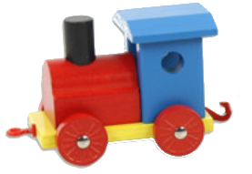
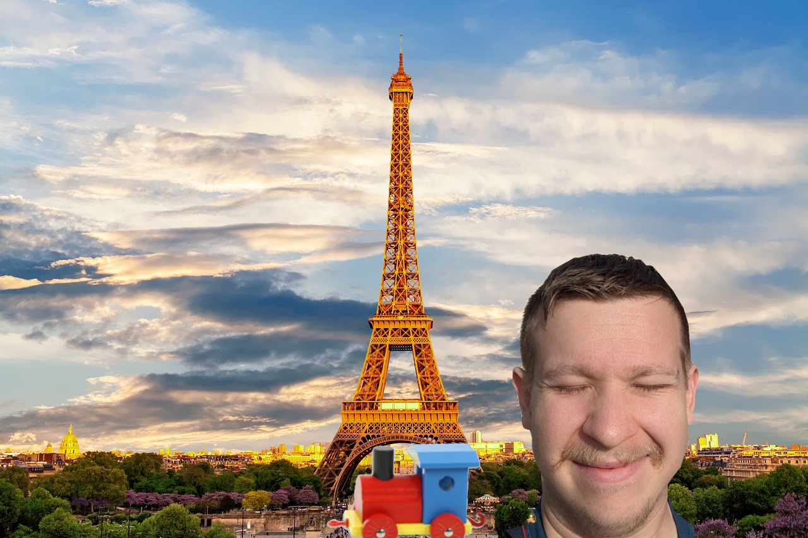
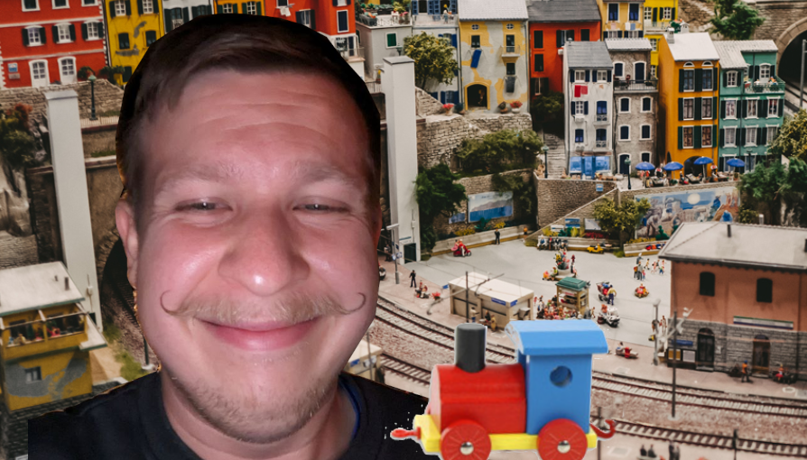
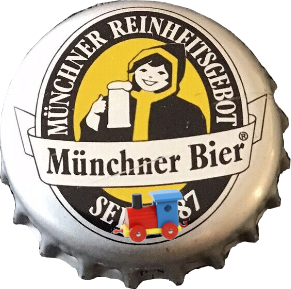
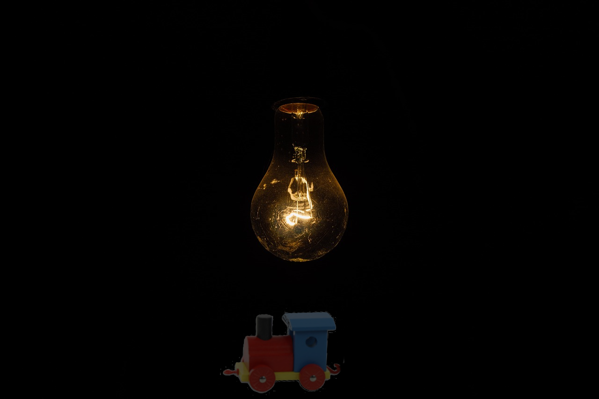
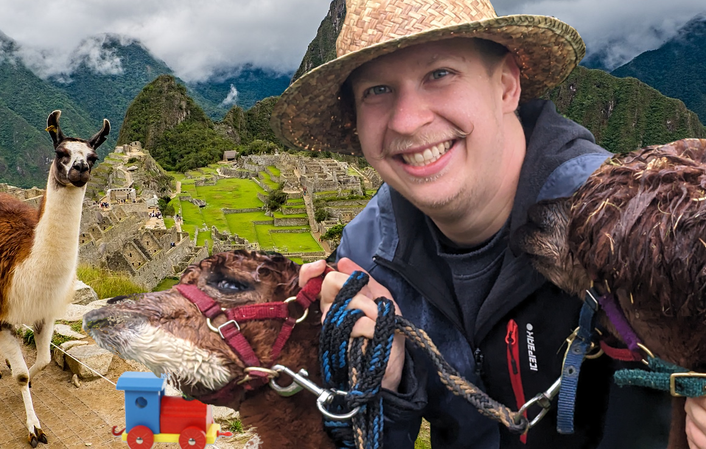
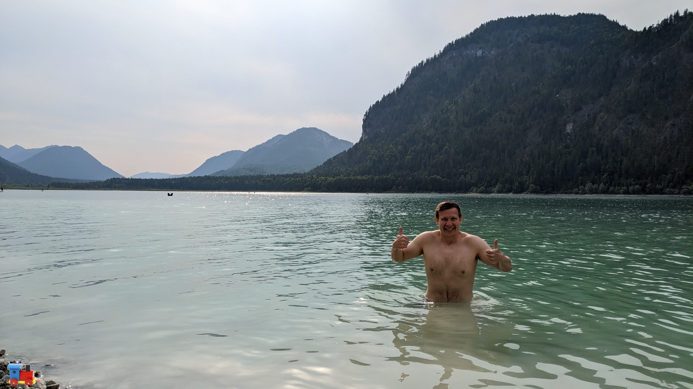

#+TITLE: Simon's Weihnachtsgeschichte 2023
#+OPTIONS: toc:nil date:nil author:nil

#+begin_src elisp :exports none
  (use-package citeproc
    :straight t)
#+end_src

#+RESULTS:

  \noindent Hohohohoho liebe Leute! Alle Jahre wieder bringt das
  Christkindl Geschenke und Simon verschickt eine
  Weihnachtsgeschichte. Falls du lieber Leser zum ersten mal in den
  unzweifelhaften Genuss einer originalen Simon's Weihnachtsgeschichte
  gekommen bist - oh man you're in for a treat! Falls nicht, dann
  weißt du dass ich evtl etwas übertreibe. Anyways die Spielregeln
  sind wie jedes Jahr die selben, wer Rechtschreibfehler findet, muss
  diese in seine Poesiealbum schreiben. Wenn du keinest hast musst du
  dir eines kaufen. Alles was hier steht ist selbstverständlich ein
  Tatsachenbericht und keine Fiktion. Wenn auch eventuell einige
  Details ausgeschmückt und oder erfunden seien könten, also
  möglicherweise. Und ja bei der Erstellung diese Machwerks kamen
  keine Pinguine, Schweine oder Schnecken zu Schaden, ich wurde
  gebeten darauf hinzuweisen. Die eine oder andere Flasche Hopfentee
  ging jedoch von uns. \newpage
* Am Bahnsteig nichts neues...

  Es ist Winter, bitterlich kalt und 2uhr in der Nacht. Leider hat das
  niemand der MVG gesagt. Die Eiszapfen bilden sich unter den
  Nasen. Hoffnungslos starren wir alle auf die Anzeigetafeln. Anstelle
  einer Zahl, die die Minuten bis zur rettenden S-Bahn signaliert,
  prankt dort ein anderes Symbol. Es soll wohl die Verspätung
  symbolisieren, jedoch erinnert es mich mehr an einen Wecker. Ein
  Wecker, der im Zorn gen Wand geworfen wird. Nur wann schlägt der
  Wecker auf? Wann zerschellt der Wecker artgerecht in all seine
  Einzelteile? Wann kommt meine scheiß S-BAHN???!

  #+ATTR_LATEX: :width 3cm
  

  \noindent Ich wickele mich enger in mein Jäckchen, nehme einen
  Schluck vom Jack(Daniels)chen und träume von einer besseren
  Welt. Eine Welt, in der die Bahn so zuverlässig ist, dass man mit
  dem 49€ Ticket sogar eine Weltreise machen kann\dots

* In 80 Zügen um die Welt
  Meine Reise beginnt in einem Gentlemans Club in London, in dem Sir
  Henry Winterbottom mit mir wettet.
  #+BEGIN_CENTER
  "Ich wette Sie schaffen es nicht einmal um die Erde zu reisen! Und
  zwar mit dem Zug!"
  #+END_CENTER
  Breit grinsend wähnt er sich schon sieges sicher, denn er hat wohl
  nichts von dem Eurotunnel gehört. In nur 40 Minunten kann man
  nämlich vom Münchner Hauptbahnhof zum Flughafen fahren. Oder von
  Frankreich nach England. Langsam klingt dieser Transrapid gar nicht
  mehr so unsinnig. Weil ich aber ein fairer Spieler bin greife ich in
  meine Jackentasche und stelle den möchtegern Schummelbaron vor
  vollendete Tatsachen. Auf seinen kleinen Rädern rollt eine Holzlok
  über den Tisch. Dem Britten fällt das Monokel vom Sockel und die
  Schnappatmung setzt ein.
  #+BEGIN_CENTER
  "Wie Sie wollen Herr Winterpopo, ich werde einmal um die Weltreisen,
  und zwar mit diesem Zug!"
  #+END_CENTER

  #+ATTR_LATEX: :width 3cm
  
  
* Paris Stadt der Kellner
  Am morgen des 2. Tages komme ich per Zug in der Stadt der Liebe und
  Croisants an. Ich kann immer noch nicht glauben, das die Schaffner
  mein 49€ ticket akzeptiert haben. Vielleicht dachten die auch
  #+begin_center
  "Schick den Irren nach Frankreich, dann ist er nicht mehr unser
  Problem\dots"
  #+end_center
  als ich Ihnen meine kleine Holzlok mit samt Weltreiseplan offenbart
  hatte. Die Zugreise war zwar kurz aber ich fühle mich gewappnet für
  ein kleines Frühstück. Der Garcon im Café ist stillecht unhöflich -
  meine 5 Brocken Französisch reichen a) um mit Händen und Füßen zu
  bestellen, b) ihn in seinem Nationalstolz zu kränken und c) mir um
  zu kapieren dass er eine Beleidung murmelt. Herrlich da fühlt man
  sich wie ein echter Tourist. Jetzt bräuchte ich nur noch eine
  riesige Kamera und kurze Hosen. Da fällt mir ein, ich muss gemäß
  meiner Wette ein Foto von mir, der Lok und einem eindeutigen
  Erkennungsmerkmal der Stadt machen, also dann.
  #+ATTR_LATEX: :width 8cm
  

  \noindent Nach meinem äußerst leckerem Frühstück begebe ich mich in
  die unzähligen Museen der Stadt - Bildung muss sein. Im Museums Shop
  finde ich eine Postkarte mit möglichst vielen Großen Französischen
  Wörtern - da wird sich der Marc-Angelo freuen. Da wir leider nicht
  mehr im Zeitalter der Brieftauben leben, muss ich jetzt eine
  Briefmarke kaufen. Laut google würde sich nette Verkäuferin über so
  etwas wie /"Je voudrais acheter cinq timbres"/ freuen. Soweit kommt
  es allerdings gar nicht. Vor mir in der Schlange spielt sich ein
  Festspiel für die Sinne ab. Eine ältere Dame wedelt mit einem
  Weckglas vor den Augen der Postmitarbeiterin herum. Am Gesicht der
  Armen erkenne ich, dass sie ungefähr soviel von dem wirren gebrable
  versteht wie ich - zero. Im inneren des Glases schwabt eine
  dickflüssige braune Masse hin und her. Es riecht nach Weihnachten,
  Gewürze, Braten. Die alte will doch nicht ernsthaft ein Glas Soße
  per Post verschicken? Die hilflosen Erklärungsversuche der Postdame
  kann ich zwar nicht verstehen, aber vermutlich sagt sie sowas wie:

  #+begin_center
  "Aber Madame, ohne Knödel kann da leider nichts für Sie machen."
  #+end_center

  \noindent Bevor die Szene eskalieren kann nimmt Soßenladie lächelnd
  reiß aus und lässt und Streblichen unschlüssig zurück. Sollen wir
  ihr folgen?  In den Wald? In ihr Hexenhaus? Ich trete einen Schritt
  vor. "Briefmarken?", frägt mich die Postfrau, die zufälligerweise
  Deutsch kann.

  \noindent Bevor es weiter geht laufe ich auf der Straße noch Sebi
  über den Weg. Nachdem wir erstaunlich lange nach einem veganen
  Imbiss gesucht haben müssen wir uns leider mit mehreren Flaschen
  Wein stärken.
* Miniaturwelten
  Wer sich nicht mit Geographie auskennt wird sich nicht darüber
  wundern, dass mein nächster Halt in Hamburg an der Elbe ist. Also
  Fischbrötchen und Hafenrundfahrt. "Macht mal ein Foto von mir",
  bitte ich Sara und Phillip. Meine beiden Leipziger habe ich nämlich
  zufälligerweise gestern Abend im goldenen Handschuh getroffen. Wir
  stehen gerade in der berühmten Miniatur Wunderwelt.
  
  #+ATTR_LATEX: :width 8cm
  

  \noindent Hamburg hat viel zu bieten. Neben dem zuvor erwähnten
  Miniaturwelten und Fischbrötchen kann man auch toll
  abstürzen. Außerdem wundere ich mich den halben Abend wieso alle so
  komisch ihre Hälser verenken um an mir vorbei durch das Fenster der
  Kneipe zu starren. Als ich selbst mal über die Schulter schaue wird
  es mir klar. Die Aufdringlichen, Leichtbekleideten die so
  interessant, sind nicht nur Junggesellenabschiedler. Nachdem wir uns
  die Böden der Biergläser ausgiebig angeschaut haben, schwanken wir
  weiter - andere Kneipen haben auch schöne Gläser.
* Eskiomobier in München
  Der ICE Richtung München über Leipzig macht das Geschäft der
  Saison. Unsere bierbegeisterte Gruppe wird irgendwann sogar bedient
  und muss nichtmal zum Bordbistro gehen - da soll noch einer was
  gegen die Deutsche Bahn sagen - hust. Meine Freunde verlassen mich
  nach und nach und schließlich bin ich ganz alleine als mein Zug in
  München einfährt. In der schönsten Millionenstadt Oberbayerns habe
  ich nur einen kurzen Aufenthalt bevor mich der nächste Zug richtung
  Süden bringen wird. Ich stehe mir also wartenderweise die Beine in
  den Bauch. Es kommt wie es kommen muss mein Zug hat Verspätung und
  nach 2 Kaffees und 2 weiteren Stunden überlege ich schon ob ich
  meine Reiseroute nicht ändern soll. Eine schwerverständliche aber
  nette Stimme verspricht mir das es jetzt bald weitergeht und
  empfielt mir und anderen Wartegästen sich doch etwas zum essen und
  trinken schmecken zu lassen. Ganz gemäß dem Motto /7 Bier sind auch
  2 Schnitzel/ begebe ich mich zu einem der Stehcafes. Ich erstehe mir
  ein nettes Bier. Beim Entkorken bemerke ich den verbogene Deckel,
  den ein anderer Hopfenteeenthusiast achtlos fallen gelassen
  hat. Darauf der berühmte Münchner Eskimo.

  #+ATTR_LATEX: :width 4cm
  

  \noindent Seit ich ein Kind bin wundere ich mich, was hat denn
  /Monaco di Baviera/ mit den Inuits zu tun? Bevor ich dieses
  Mysterium aufklären kann erklingt mein Smartphone
  engelsgleich. Besser gesagt das Sociale Network für Alkoholiker und
  solche die es werden wollen teilt mir mit das die liebe Laura gerade
  ein Bier trinkt und Leute zum Anstoßen sucht. Da kann ich mich nicht
  Lumpen lassen, wann ist man denn schonmal in der Stadt? Die app gibt
  mir 3 Möglichkeiten auf die Pushbenachrichtigung zu reagieren a)
  Prost, b) Warte ich komm auch noch oder c) BIER!. Na da kann man ja
  nicht falsch antworten.

* /Alpenüberquerung/
  #+begin_export latex
  \begin{wrapfigure}{r}{0.4\textwidth} %this figure will be at the right
    \centering
    \includegraphics[width=0.4\textwidth]{alpen.png}
  \end{wrapfigure}
  #+end_export
  Nach Hamburg und München sind Kopfschmerztabletten meine besten
  Freunde. Wenn man sich mit Laura auf ein Bier trifft ist sicher es
  wird lustig, es wird viel getrunken und egal wie sehr man sich
  vorgenommen hat rechtzeitig zu gehen man verpasst seinen
  Zug. Lustigerweise war jedoch der letzte Punkt in diesem Fall gar
  nicht so. Das lag jedoch nicht daran, dass ich es dieses mal
  geschafft hatte mich rechtzeitig los zu eisen - der Abend wurde wie
  zu erwarten viel später als geplant - allerdings spielte der Zug in
  meinem Sinne mit und kam nicht. Einen Zug der nicht kommt, den
  kannst du auch nicht verpassen. Deswegen, und wegen ein paar Bier zu
  viel, sitze ich jetzt auch nicht im ICE, sondern in einer Regio, die
  im weitesten Sinne mehr S-Bahn als Zug ist. Mein neuer Plan, der
  gestern Abend noch sehr viel Sinn ergab ist, per Zug nach Garmisch
  und per Fuß über die Grenze. Wieso sich das gestern, auch nur
  geringfügig weniger hirnrissig angehört hat als jetzt, ist mir auch
  schleierhaft. Jedenfalls bin ich gerade um jeden Moment, in dem ich
  nicht denken muss froh. Der Zug hält an und ich stolper heraus. Und
  was dürfen meine glasigen Augen erblicken - Raul, Nina und Dani der
  Hund warten auf mich. Jetzt macht das alles Sinn. Der betrunken
  Simon von gestern Abend hat sich wohl gedacht er macht dem nüchteren
  Simon eine Freude und verabredet sich zum Wandern.  Raul kann sich
  ob meines Zustandes ein Grinsen nicht verkneifen, Dani der Hund ist
  voller Vorfreude. Vor dem Aufstieg machen wir noch ein Foto, dessen
  Inhalt ich aus Datenrechtlichen Gründen, und nicht weil ich darauf
  komplett fertig aussehe, leider nicht zeigen darf. Aber als Beweis
  meiner vielen Gipfelbesteigungen habe ich ein anderes angehängt.

  
* Intalien in der Sauna
    #+begin_export latex
  \begin{wrapfigure}{r}{0.4\textwidth} %this figure will be at the right
    \centering
    \includegraphics[width=0.4\textwidth]{sauna.png}
  \end{wrapfigure}
  #+end_export
  Nach Kaiserschmarn und Hüttenzauber sind wir dann auch irgendwann
  wieder herab gestiegen von unsrem hohen Berg. Derselbe Zug brachte
  uns zurück nach München wo ich auch die Nacht verbrachte. Am
  nächsten morgen in alter Frische sitze ich im Auto Richtung
  Süden. Meine Reiselok steht auf dem Amaturenbrett, die darf ich um
  Himmelswillen nicht im Mietauto vergessen. Ja ich gebe es zu das mit
  dem Zug war mir dann doch ein bisschen zu doof. Jetzt also
  auch. Okay man kann sich auch über das Autofahren ärgern. Spätestens
  wenn man sich mit Vignette, Streckenmaut, Kettenpflicht ja?nein?
  etc. rumschlangen muss. Ich tucker also über den Brenner und
  hinunter nach Bozen. In Bozen komme ich genau passend zum
  Mittagessen an. Bzw. ich ich bin zu früh, aber Helden wie ich lösen
  so ein Problem dadurch das sie sich multiple male in einer
  kleinstadt verfahren auf der suche nach dem Parkhaus im
  Stadtzentrum. Pünktlich zur Mittagszeit verlasse ich das Parkhaus am
  Waltherplatz und spaziere voller Vorfreude los. Ich biege ums Eck
  und laufe in Yumi und David hinein. (Dem werten Leser fällt hier
  vielleicht auf, dass es etwas ungewöhnlich ist, dass ich auf meiner
  Reise immer passend in meine Freunde treffe und wir in der Realität
  eventuell gemeinsam angereist sind.) Um Yumis Geburtstag zu feiern
  entscheiden wir spontan eine Berghütte mit Sauna und Whirlpool für
  das Wochenende zu mieten. 
  
* Lorenzo von Arabien
  #+begin_export latex
  \begin{wrapfigure}{r}{0.4\textwidth} %this figure will be at the right
    \centering
    \includegraphics[width=0.4\textwidth]{wueste.png}
  \end{wrapfigure}
  #+end_export

  Meinen Mietwagen habe ich in Venedig gegen ein Schiff eingetauscht
  mit dem ich übers Meer, den Suez kanal runter fahren wollte. An
  Ägypten vorbei, durch den Golf von Aden und ab richtung
  Australien. Leider sind Schiffe deutlich schwere zu steueren als man
  denkt. Wer sich noch an die Schlagzeilen erinnert von dem Schiff das
  den Suez Kanal blockiert hat weil es sich quer gestellt hat,
  ja. Ernsthaft die dinger sind echt schwerer zu steuern als man
  denkt. Anyways. Mein riesiges Containerschiff war im Tausch soviel
  Wert um meinen nächsten Mode-of-Transportation zu erhalten.

  
  Kamele mit zwei Höckern nennt man Trampeltiere. Und manche
  bezeichnen die netten Paarhufer als Wüstenschiffe. Gleichzeitig ist
  eine Karawane eine art Zug und daher würde ich sagen ich reise per
  Zug durch die hier nicht näher definierte Wüste.  Schließlich dachte
  ich mir Die Hitze ist gar nicht so extrem, stell dir einen Zug der
  deutschen Bahn im Sommer vor, dass kommt ganz gut hin. Wie es sich
  für einen guten Zug gehört halten auch wir praktisch überall. Ich
  dachte nie, dass man bei einer Reise durch die Wüste genug von Oasen
  bekommen kann. Aber spätestens nach dem 5. Stop für Selfies,
  zwischen Fake Palmen und Einheimischen, die aggressiv irgendwelchen
  Schrott los werden reicht es mir. Ich umfasse die Holzlok unter dem
  Gewand und gebe dem Kamele die Sporen. Hinter mir höre ich noch
  aufgeregte Stimmen auf Arabisch und Amerikaner, die denken das das
  eine Showeinlage ist: "Amazing". Mein Wüstenschiff wird vom Tret-
  zum Speedbot und schießt über die Dünen. Ich kralle mich krampfhaft
  fest und merke gar nicht wie schnell die Oase kleiner wir. Auch
  fällt mir nicht auf wie der Wind anfängt sanft den Sand
  aufzuwirbeln. Als Kunibert das Kamele endlich langsamer wird ist es
  nicht weil das Tier müde ist, sondern aus einem anderen Grund. Kuni
  geht auf die Knie, schließt die Augen und atmet schnaubend aus. Und
  dann trifft mich die erste hand Sand ins Gesicht - ein Sturm steht
  am Horizont.
  
* Vom Regen in die Traufe
  Kopfschüttelnde Beduinen haben den doofen Touristen
  ausgegraben. Dann haben sie mich im Tausch gegen mein Kamel in die
  nächste Hafenstadt gebracht. Seit ein paar Tagen tuckern wir
  richtung Indien, glaube ich zumindest. Ich bin auch nicht auf einem
  Kreuzfahrtschiff oder ähnlichem. Diesemal ist es auch kein
  Containerschiff ich bin ja lernfähig. Ein wohlriechender Fischkutter
  kämpft sich über die wilden Wogen. Die japanischen Seeleute schreien
  sich Kommandos zu, die See braust, ich kotze über die Reling. Es ist
  ein Bild für schadenfreudige Menschen. Die Wellen schlagen
  unerbidlich gegen unser Schiff. Wumm. Kotz. Wumm. Würg. Wumm. Salto
  über die Reling. Kaltes, salziges Wasser brennt im Rachen und den
  Augen. Am Anfang kämpfe ich noch aber bald wird es mir schwarz vor
  den Augen und ich sinke hinab. Als ich wieder zu mir komme kann ich
  Atmen. Glaubt es mir oder auch nicht aber ich sitze im Inneren eines
  Wals. Von der Decke baumelt eine Glühbirne, die meine fischige
  Umgebung kaum erhellt. Ein großer roter Finger tippt mich an der
  Schulter an. Ich drehe mich um, sehe aber praktisch nichts - es ist
  ja sehr dunkel. Eine tiefe Bassstimme frägt: "Willst du ein IPhone?"

  #+ATTR_LATEX: :width 8cm
  

* Auf den Spuren der Inka
  Wilhelm der Wal strandete in Peru auf einem Strand. Gott sei Dank
  waren Tierschützer direkt vor ort. Es ist also keine traurige Wal am
  Strand verendet kind of story hier. Unter den Tierschützern ist
  praktischerweise die Vroni. Gemeinsam entscheiden wir eine
  Lamawanderung zum Machu Piccu zu machen. Meine beide Lamas heißen
  SpuckSpuck und PfuiPfui - die Namen sind Program. Vroni hat da mehr
  Glück und auch ein besseres Händchen für die Tiere. 

  #+ATTR_LATEX: :width 8cm
  

* Das Dschunglebuch
  Ich stehe mit einer riesen Landkarte im Dschungel. Gerade als ich
  das Ding weg packen will, surrt eine Machete. Das kleine Schwert
  teilt das Papier sauber an der Faltkante. Mir gegenüber steht der
  Ofenbaumeister vom Dienst - im Tropenoutfit.

  #+begin_center
  "Marci! Und wie jetzt weiter?", frage ich mit Blick auf die
  Schneise.
  #+end_center

  \noindent Marc hat sich einen Weg durch die Bäume gebahnt, dem wir
  jetzt zurück folgen. Die Urwaldgeräusche werden zunehmenden durch
  das Rauschen von Wasser übertönt. Als wir durchbrechen stehen wir am
  Ufer eines majestetischen Flusses.

  #+begin_center
  "Und jetzt fahren wir mit dem Schlauchboot!", eröffnet mir Marc.
  #+end_center

  \noindent Wir haben doch tatsächlich nach wochenlangen Herumirren im
  Dschungel einen der größsten Flüsse der Welt gefunden. Das Ziel ist
  nun dem Fluss bis zu seiner Mündung im Atlantik zu folgen und da das
  finale Schiff nach London zu nehmen. Was für ein Glück das ich vor
  ein paar Wochen in Bolivien meinem alten Kumpel Marc über den Weg
  gelaufen bin. Ich war in der völlig falschen Richtung
  unterwegs. Marc hat natürlich auch ein stabiles Schlauchboot dabei,
  dass wir als nächstes aufpumpen. Wer jetzt aber denkt, dass wir uns
  einfach treiben lassen der irrt sich. Dafür sind wir viel zu
  ambitioniert. Stundenlang heißt es /zu gleich, zu
  gleich/. Schließlich hällt Marc innen und frägt mich

  #+begin_center
  "Weißt du was heute für ein Tag ist?"
  #+end_center

  \noindent Bevor ich verstehe worauf die Frage abzieht bin ich schon
  über Bord. Es ist mein Geburtstag und da wird man schon mal ins
  Wasser geworfen.
  
  #+ATTR_LATEX: :width 8cm
  

* Das Ende
  Unser Dampfschiff pfeift aus dem letzen Loch. Wer Jules Verne
  gelesen hat - oder wie ich die Verfilmungen geshene hat - weiß was
  nun kommt. In der Buchvorlage musste Phileas Fogg in 80 Tagen um die
  Welt reisen. Um die Deadline einzuhalten kaufte er am Ende das
  Schiff, auf dem er Richtung Ziel raste. Um noch schneller voran
  zukommen befahl er den Matrosen dann alles brennbare an Bord
  abzureißen und in den Kessel zu werfen. Als Ergebnis kam die Crew im
  Endeffekt auf einem nackten Schiffrumpf im Hafen an. Ich habe zwar
  keine vergleichbare Deadline, aber die Idee das Schiff auf dem du
  fährst parallel zu verheizen klingt so herrlich bescheuert, dass es
  der perfekte Abschied zu einer gelungenen Weltreise ist. Mit
  Zylinder, Monocle und Zigarre im Mundwinkel haben Marc und ich dem
  Kapitän das Schiff abgekauft. Und mit deinem Eigentum darfst du
  machen was du willst. Während wir herschaftlich am Bug den Hafen
  näher kommen sehen zersägt die Crew hinter uns das Boot. Und damit
  endet nicht nur meine Weltreise, sondern auch der schöne Traum von
  einer besseren Welt. Einer Welt in der man per Zug einmal um den
  Globus kommt. Denn einer der motivierten Matrosen sieht meine
  Holzlok irgendwo rumstehen und wirft das Ding ins Feuer! Seufzend
  erwache ich aus meinem Tagtraum. Nach stundenlangen Warten am S-Bahn
  Gleis kommt nun doch noch die finale Durchsage.

  #+begin_center
  "Sehr geehrte Damen und Herren. Die S3 fällt heute leider
  aus. Schienenersatz verkehr besteht auch nicht. Viel Spaß beim zu
  Fuß nach Hause gehen."
  #+end_center
* Nachwort
  #+begin_center
  So liebe Leute das wars diese Jahr wieder von mir. Ich hoffe das
  lesen dieser kleinen Geschichte konnte dir Freude
  bereiten. Fröhliche Weihnachten und einen guten Rutsch ins neue
  Jahr.
  #+end_center
  

